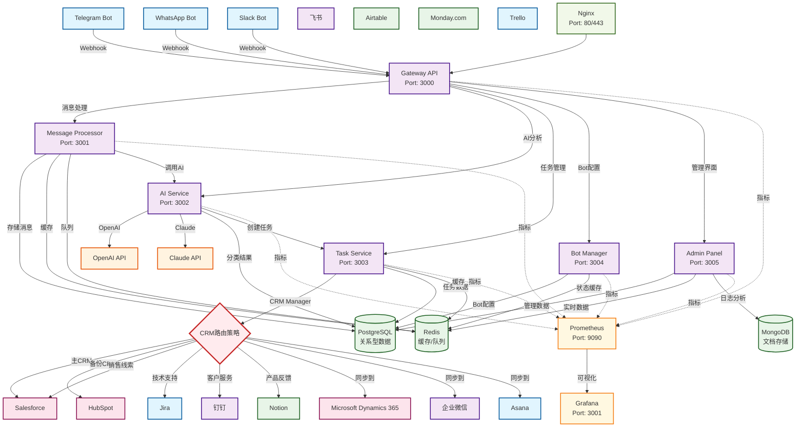

# Octopus Messenger

一个多平台消息处理和任务管理系统，支持Telegram、WhatsApp、Slack等平台的机器人集成，通过AI智能分类客户意见并自动在Lark中创建任务。

## 功能特性

- 🤖 多平台Bot支持（Telegram、WhatsApp、Slack、Discord）
- 🧠 AI智能分类和过滤（Claude、OpenAI）
- 📝 多CRM系统集成（16+主流CRM支持）
- 🏗️ 微服务架构设计
- 🔧 Docker容器化部署
- 📊 实时监控和日志
- 🔐 多租户SAAS架构

## 系统架构

以下是Octopus Messenger的多CRM集成架构图：



### 多CRM集成策略

1. **主备模式**: 主CRM失败时自动切换到备用CRM
2. **分类路由**: 根据消息分类路由到不同的CRM系统
3. **并行同步**: 同时同步到多个CRM系统以确保数据一致性

## 快速开始

### 环境要求

- Docker & Docker Compose
- Node.js 18+
- Python 3.9+
- PostgreSQL 14+
- Redis 7+

### 一键安装部署

#### 🚀 自动配置脚本（推荐）
```bash
# 克隆项目
git clone https://github.com/LavasLabs/octopus-messenger.git
cd octopus-messenger

# 运行自动配置脚本
./scripts/setup-local.sh
```

#### 📝 手动配置
1. 克隆项目
```bash
git clone https://github.com/LavasLabs/octopus-messenger.git
cd octopus-messenger
```

2. 配置环境变量
```bash
cp docs/env-template.txt .env
# 编辑.env文件，填入相关API密钥
```

3. 启动服务
```bash
# 使用Docker（推荐）
docker-compose up -d

# 或手动启动
npm install
npm run db:migrate
npm run dev
```

**💡 提示**: 详细配置说明请查看[本地部署指南](docs/Local-Deployment-Guide.md)

## 服务组件

| 服务 | 端口 | 描述 |
|------|------|------|
| Gateway API | 3000 | 主API网关 |
| Message Processor | 3001 | 消息处理服务 |
| AI Service | 3002 | AI分类服务 |
| Task Service | 3003 | 任务管理服务 |
| Bot Manager | 3004 | Bot管理服务 |
| Admin Panel | 3005 | 管理面板 |

## 支持的CRM系统

### 🏢 企业级CRM
- **Salesforce** - 全球最大的CRM平台
- **Microsoft Dynamics 365** - 微软企业解决方案  
- **HubSpot** - 入站营销CRM

### 📱 中国本土CRM
- **钉钉** - 阿里巴巴企业协作平台
- **企业微信** - 腾讯企业通讯解决方案
- **飞书** - 字节跳动协作平台

### 🚀 现代化工具
- **Notion** - 全能工作空间
- **Airtable** - 可视化数据库
- **Monday.com** - 工作操作系统

### 📋 项目管理工具
- **Jira** - Atlassian项目管理
- **Asana** - 团队协作平台
- **ClickUp** - 全功能生产力平台
- **Linear** - 现代化问题跟踪
- **Trello** - 看板式项目管理

### 💼 其他专业工具
- **Zoho CRM** - 一体化业务套件
- **Pipedrive** - 销售管道CRM

## 开发

### 本地开发

```bash
# 安装依赖
npm install

# 启动开发环境
npm run dev

# 运行测试
npm run test

# 构建生产版本
npm run build
```

### API文档

访问 `http://localhost:3000/api/docs` 查看完整API文档

## 📖 文档

- [快速开始](docs/Quick-Start.md) - 5分钟快速体验系统
- [本地部署指南](docs/Local-Deployment-Guide.md) - 本地开发环境配置
- [Bot配置指南](docs/Bot-Configuration-Guide.md) - 详细的Bot配置步骤
- [CRM集成指南](docs/CRM-Integration-Guide.md) - 多CRM系统集成配置
- [用户使用指南](docs/User-Guide.md) - 完整的用户手册
- [API文档](docs/API-Documentation.md) - REST API接口文档
- [部署指南](docs/Deployment-Guide.md) - 生产环境部署和运维指南
- [项目架构](PROJECT-STRUCTURE.md) - 项目结构说明

## 贡献

欢迎提交Issue和Pull Request！

## 许可证

MIT License 