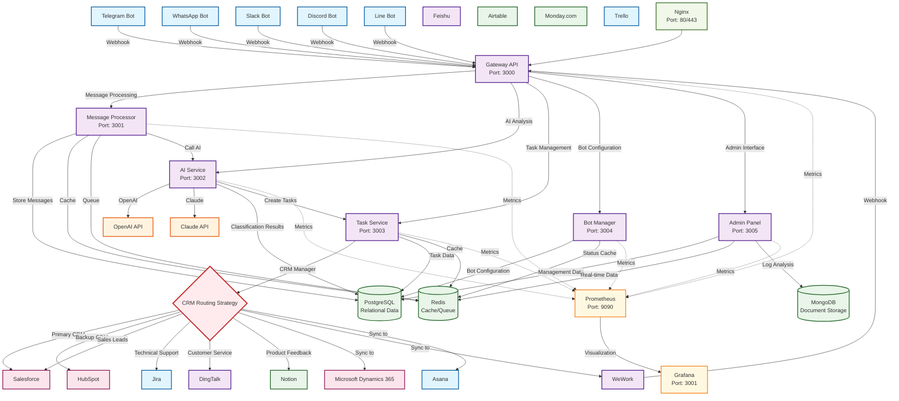

# Octopus Messenger

A multi-platform messaging and task management system that supports bot integration across Telegram, WhatsApp, Slack, and other platforms, intelligently categorizing customer feedback through AI and automatically creating tasks in Lark.

## Features

- 🤖 Multi-platform bot support (Telegram, WhatsApp, Slack, Discord, Line, WeWork)
- 🧠 AI-powered classification and filtering (Claude, OpenAI)
- 📝 Multi-CRM system integration (16+ mainstream CRM support)
- 🏗️ Microservices architecture design
- 🔧 Docker containerized deployment
- 📊 Real-time monitoring and logging
- 🔐 Multi-tenant SaaS architecture

## System Architecture

The following diagram shows the multi-CRM integration architecture of Octopus Messenger:



### Multi-CRM Integration Strategy

1. **Primary-Backup Mode**: Automatically switches to backup CRM when primary CRM fails
2. **Classification Routing**: Routes messages to different CRM systems based on classification
3. **Parallel Synchronization**: Synchronizes to multiple CRM systems simultaneously to ensure data consistency

## Quick Start

### Prerequisites

- Docker & Docker Compose
- Node.js 18+
- Python 3.9+
- PostgreSQL 14+
- Redis 7+

### One-Click Installation & Deployment

#### 🚀 Automated Configuration Script (Recommended)
```bash
# Clone the repository
git clone https://github.com/LavasLabs/octopus-messenger.git
cd octopus-messenger

# Run automated setup script
./scripts/setup-local.sh
```

#### 📝 Manual Configuration
1. Clone the repository
```bash
git clone https://github.com/LavasLabs/octopus-messenger.git
cd octopus-messenger
```

2. Configure environment variables
```bash
cp docs/env-template.txt .env
# Edit .env file and fill in relevant API keys
```

3. Start services
```bash
# Using Docker (Recommended)
docker compose up -d

# Or manual startup
npm install
npm run db:migrate
npm run dev
```

**💡 Tip**: For detailed configuration instructions, please check the [Local Deployment Guide](docs/Local-Deployment-Guide.md)

## Service Components

| Service | Port | Description |
|---------|------|-------------|
| Gateway API | 3000 | Main API Gateway |
| Message Processor | 3001 | Message Processing Service |
| AI Service | 3002 | AI Classification Service |
| Task Service | 3003 | Task Management Service |
| Bot Manager | 3004 | Bot Management Service |
| Admin Panel | 3005 | Administration Panel |

## Supported CRM Systems

### 🏢 Enterprise CRM
- **Salesforce** - World's largest CRM platform
- **Microsoft Dynamics 365** - Microsoft enterprise solution  
- **HubSpot** - Inbound marketing CRM

### 📱 China Local CRM
- **DingTalk** - Alibaba enterprise collaboration platform
- **WeWork** - Tencent enterprise communication solution
- **Feishu** - ByteDance collaboration platform

### 🚀 Modern Tools
- **Notion** - All-in-one workspace
- **Airtable** - Visual database
- **Monday.com** - Work operating system

### 📋 Project Management Tools
- **Jira** - Atlassian project management
- **Asana** - Team collaboration platform
- **ClickUp** - All-in-one productivity platform
- **Linear** - Modern issue tracking
- **Trello** - Kanban-style project management

### 💼 Other Professional Tools
- **Zoho CRM** - All-in-one business suite
- **Pipedrive** - Sales pipeline CRM

## Development

### Local Development

```bash
# Install dependencies
npm install

# Start development environment
npm run dev

# Run tests
npm run test

# Build for production
npm run build
```

### API Documentation

Visit `http://localhost:3000/api/docs` to view complete API documentation

## 📖 Documentation

- [Quick Start](docs/Quick-Start.md) - 5-minute quick system experience
- [Local Deployment Guide](docs/Local-Deployment-Guide.md) - Local development environment setup
- [Bot Configuration Guide](docs/Bot-Configuration-Guide.md) - Detailed bot configuration steps
- [CRM Integration Guide](docs/CRM-Integration-Guide.md) - Multi-CRM system integration configuration
- [User Guide](docs/User-Guide.md) - Complete user manual
- [API Documentation](docs/API-Documentation.md) - REST API interface documentation
- [Deployment Guide](docs/Deployment-Guide.md) - Production environment deployment and operations guide
- [Project Structure](PROJECT-STRUCTURE.md) - Project structure description

## Contributing

Issues and Pull Requests are welcome!

## License

MIT License 