# Octopus Messenger AWS 部署指南

## 概述

本指南提供了将Octopus Messenger系统部署到AWS云平台的完整解决方案。采用现代云原生架构，利用AWS托管服务实现高可用性、可扩展性和成本效益。

## 架构设计

### 系统架构图

```mermaid
graph TB
    subgraph "Internet"
        Users[用户]
        Bots[Bot平台<br/>Telegram/WhatsApp/Discord]
    end
    
    subgraph "AWS Cloud"
        subgraph "Edge Layer"
            CF[CloudFront CDN]
            R53[Route 53 DNS]
            ACM[Certificate Manager]
        end
        
        subgraph "Load Balancer"
            ALB[Application Load Balancer]
        end
        
        subgraph "VPC - us-east-1"
            subgraph "Public Subnet"
                NAT[NAT Gateway]
                ALB
            end
            
            subgraph "Private Subnet A"
                subgraph "ECS Cluster"
                    ECS1[ECS Service<br/>Gateway:3000]
                    ECS2[ECS Service<br/>Message Processor:3001]
                    ECS3[ECS Service<br/>AI Service:3002]
                end
            end
            
            subgraph "Private Subnet B"
                subgraph "ECS Cluster"
                    ECS4[ECS Service<br/>Task Service:3003]
                    ECS5[ECS Service<br/>Bot Manager:3004]
                    ECS6[ECS Service<br/>Admin Panel:3005]
                end
            end
            
            subgraph "Database Subnet"
                RDS[RDS PostgreSQL<br/>Multi-AZ]
                ElastiCache[ElastiCache Redis<br/>Cluster Mode]
                DocumentDB[DocumentDB<br/>MongoDB Compatible]
            end
        end
        
        subgraph "Container Registry"
            ECR[ECR Repository]
        end
        
        subgraph "Monitoring"
            CW[CloudWatch]
            XRay[X-Ray Tracing]
        end
        
        subgraph "Storage"
            EFS[EFS Shared Storage]
            S3[S3 Bucket]
        end
        
        subgraph "CI/CD"
            CodePipeline[CodePipeline]
            CodeBuild[CodeBuild]
            CodeDeploy[CodeDeploy]
        end
    end
    
    Users --> CF
    Bots --> ALB
    CF --> ALB
    R53 --> ALB
    
    ALB --> ECS1
    ALB --> ECS2
    ALB --> ECS3
    ALB --> ECS4
    ALB --> ECS5
    ALB --> ECS6
    
    ECS1 --> RDS
    ECS2 --> RDS
    ECS3 --> RDS
    ECS4 --> RDS
    ECS5 --> RDS
    ECS6 --> RDS
    
    ECS1 --> ElastiCache
    ECS2 --> ElastiCache
    ECS3 --> ElastiCache
    ECS4 --> ElastiCache
    ECS5 --> ElastiCache
    ECS6 --> ElastiCache
    
    ECS1 --> DocumentDB
    ECS2 --> DocumentDB
    ECS3 --> DocumentDB
    ECS4 --> DocumentDB
    ECS5 --> DocumentDB
    ECS6 --> DocumentDB
    
    CodePipeline --> CodeBuild
    CodeBuild --> ECR
    CodeBuild --> CodeDeploy
    CodeDeploy --> ECS1
    CodeDeploy --> ECS2
    CodeDeploy --> ECS3
    CodeDeploy --> ECS4
    CodeDeploy --> ECS5
    CodeDeploy --> ECS6
    
    ECS1 --> CW
    ECS2 --> CW
    ECS3 --> CW
    ECS4 --> CW
    ECS5 --> CW
    ECS6 --> CW
    
    ECS1 --> EFS
    ECS2 --> EFS
    ECS3 --> EFS
    ECS4 --> EFS
    ECS5 --> EFS
    ECS6 --> EFS
```



## 环境准备

### 1. AWS账户设置

```bash
# 安装AWS CLI
curl "https://awscli.amazonaws.com/awscli-exe-linux-x86_64.zip" -o "awscliv2.zip"
unzip awscliv2.zip
sudo ./aws/install

# 配置AWS凭证
aws configure
```

### 2. 安装必要工具

```bash
# 安装Terraform
curl -fsSL https://apt.releases.hashicorp.com/gpg | sudo apt-key add -
sudo apt-add-repository "deb [arch=amd64] https://apt.releases.hashicorp.com $(lsb_release -cs) main"
sudo apt-get update && sudo apt-get install terraform

# 安装Docker
curl -fsSL https://get.docker.com | sudo sh
sudo usermod -aG docker $USER

# 安装ECS CLI
sudo curl -Lo /usr/local/bin/ecs-cli https://amazon-ecs-cli.s3.amazonaws.com/ecs-cli-linux-amd64-latest
sudo chmod +x /usr/local/bin/ecs-cli
```

### 3. 设置环境变量

```bash
# 创建部署配置文件
cat << EOF > aws-deploy.env
AWS_REGION=us-east-1
AWS_ACCOUNT_ID=123456789012
PROJECT_NAME=octopus-messenger
ENVIRONMENT=production
VPC_CIDR=10.0.0.0/16
EOF

source aws-deploy.env
```

## 基础设施部署

### 1. 网络架构 (VPC)

创建 `terraform/vpc.tf`:

```hcl
# VPC配置
resource "aws_vpc" "main" {
  cidr_block           = "10.0.0.0/16"
  enable_dns_hostnames = true
  enable_dns_support   = true

  tags = {
    Name        = "${var.project_name}-vpc"
    Environment = var.environment
  }
}

# Internet Gateway
resource "aws_internet_gateway" "main" {
  vpc_id = aws_vpc.main.id

  tags = {
    Name        = "${var.project_name}-igw"
    Environment = var.environment
  }
}

# 公共子网
resource "aws_subnet" "public" {
  count = 2
  
  vpc_id                  = aws_vpc.main.id
  cidr_block              = "10.0.${count.index + 1}.0/24"
  availability_zone       = data.aws_availability_zones.available.names[count.index]
  map_public_ip_on_launch = true

  tags = {
    Name        = "${var.project_name}-public-${count.index + 1}"
    Environment = var.environment
    Type        = "public"
  }
}

# 私有子网 - 应用层
resource "aws_subnet" "private_app" {
  count = 2
  
  vpc_id            = aws_vpc.main.id
  cidr_block        = "10.0.${count.index + 10}.0/24"
  availability_zone = data.aws_availability_zones.available.names[count.index]

  tags = {
    Name        = "${var.project_name}-private-app-${count.index + 1}"
    Environment = var.environment
    Type        = "private-app"
  }
}

# 私有子网 - 数据库层
resource "aws_subnet" "private_db" {
  count = 2
  
  vpc_id            = aws_vpc.main.id
  cidr_block        = "10.0.${count.index + 20}.0/24"
  availability_zone = data.aws_availability_zones.available.names[count.index]

  tags = {
    Name        = "${var.project_name}-private-db-${count.index + 1}"
    Environment = var.environment
    Type        = "private-db"
  }
}

# NAT Gateway
resource "aws_eip" "nat" {
  count = 2
  domain = "vpc"

  tags = {
    Name        = "${var.project_name}-nat-eip-${count.index + 1}"
    Environment = var.environment
  }
}

resource "aws_nat_gateway" "main" {
  count = 2
  
  allocation_id = aws_eip.nat[count.index].id
  subnet_id     = aws_subnet.public[count.index].id

  tags = {
    Name        = "${var.project_name}-nat-${count.index + 1}"
    Environment = var.environment
  }
}

# 路由表
resource "aws_route_table" "public" {
  vpc_id = aws_vpc.main.id

  route {
    cidr_block = "0.0.0.0/0"
    gateway_id = aws_internet_gateway.main.id
  }

  tags = {
    Name        = "${var.project_name}-public-rt"
    Environment = var.environment
  }
}

resource "aws_route_table" "private_app" {
  count = 2
  
  vpc_id = aws_vpc.main.id

  route {
    cidr_block     = "0.0.0.0/0"
    nat_gateway_id = aws_nat_gateway.main[count.index].id
  }

  tags = {
    Name        = "${var.project_name}-private-app-rt-${count.index + 1}"
    Environment = var.environment
  }
}

# 路由表关联
resource "aws_route_table_association" "public" {
  count = 2
  
  subnet_id      = aws_subnet.public[count.index].id
  route_table_id = aws_route_table.public.id
}

resource "aws_route_table_association" "private_app" {
  count = 2
  
  subnet_id      = aws_subnet.private_app[count.index].id
  route_table_id = aws_route_table.private_app[count.index].id
}
```

### 2. 安全组配置

创建 `terraform/security_groups.tf`:

```hcl
# ALB安全组
resource "aws_security_group" "alb" {
  name        = "${var.project_name}-alb-sg"
  description = "Security group for Application Load Balancer"
  vpc_id      = aws_vpc.main.id

  ingress {
    from_port   = 80
    to_port     = 80
    protocol    = "tcp"
    cidr_blocks = ["0.0.0.0/0"]
  }

  ingress {
    from_port   = 443
    to_port     = 443
    protocol    = "tcp"
    cidr_blocks = ["0.0.0.0/0"]
  }

  egress {
    from_port   = 0
    to_port     = 0
    protocol    = "-1"
    cidr_blocks = ["0.0.0.0/0"]
  }

  tags = {
    Name        = "${var.project_name}-alb-sg"
    Environment = var.environment
  }
}

# ECS任务安全组
resource "aws_security_group" "ecs_tasks" {
  name        = "${var.project_name}-ecs-tasks-sg"
  description = "Security group for ECS tasks"
  vpc_id      = aws_vpc.main.id

  ingress {
    from_port       = 3000
    to_port         = 3005
    protocol        = "tcp"
    security_groups = [aws_security_group.alb.id]
  }

  egress {
    from_port   = 0
    to_port     = 0
    protocol    = "-1"
    cidr_blocks = ["0.0.0.0/0"]
  }

  tags = {
    Name        = "${var.project_name}-ecs-tasks-sg"
    Environment = var.environment
  }
}

# RDS安全组
resource "aws_security_group" "rds" {
  name        = "${var.project_name}-rds-sg"
  description = "Security group for RDS database"
  vpc_id      = aws_vpc.main.id

  ingress {
    from_port       = 5432
    to_port         = 5432
    protocol        = "tcp"
    security_groups = [aws_security_group.ecs_tasks.id]
  }

  tags = {
    Name        = "${var.project_name}-rds-sg"
    Environment = var.environment
  }
}

# ElastiCache安全组
resource "aws_security_group" "elasticache" {
  name        = "${var.project_name}-elasticache-sg"
  description = "Security group for ElastiCache"
  vpc_id      = aws_vpc.main.id

  ingress {
    from_port       = 6379
    to_port         = 6379
    protocol        = "tcp"
    security_groups = [aws_security_group.ecs_tasks.id]
  }

  tags = {
    Name        = "${var.project_name}-elasticache-sg"
    Environment = var.environment
  }
}

# DocumentDB安全组
resource "aws_security_group" "documentdb" {
  name        = "${var.project_name}-documentdb-sg"
  description = "Security group for DocumentDB"
  vpc_id      = aws_vpc.main.id

  ingress {
    from_port       = 27017
    to_port         = 27017
    protocol        = "tcp"
    security_groups = [aws_security_group.ecs_tasks.id]
  }

  tags = {
    Name        = "${var.project_name}-documentdb-sg"
    Environment = var.environment
  }
}
```

### 3. 数据库部署

创建 `terraform/databases.tf`:

```hcl
# RDS PostgreSQL
resource "aws_db_subnet_group" "main" {
  name       = "${var.project_name}-db-subnet-group"
  subnet_ids = aws_subnet.private_db[*].id

  tags = {
    Name        = "${var.project_name}-db-subnet-group"
    Environment = var.environment
  }
}

resource "aws_db_instance" "postgres" {
  identifier             = "${var.project_name}-postgres"
  engine                 = "postgres"
  engine_version         = "15.3"
  instance_class         = "db.t3.medium"
  allocated_storage      = 100
  max_allocated_storage  = 1000
  storage_type           = "gp3"
  storage_encrypted      = true
  
  db_name  = "octopus_messenger"
  username = "postgres"
  password = var.db_password
  
  vpc_security_group_ids = [aws_security_group.rds.id]
  db_subnet_group_name   = aws_db_subnet_group.main.name
  
  backup_retention_period = 30
  backup_window          = "03:00-04:00"
  maintenance_window     = "sun:04:00-sun:05:00"
  
  multi_az               = true
  publicly_accessible    = false
  
  skip_final_snapshot = false
  final_snapshot_identifier = "${var.project_name}-postgres-final-snapshot"
  
  performance_insights_enabled = true
  monitoring_interval         = 60
  monitoring_role_arn        = aws_iam_role.rds_monitoring.arn
  
  tags = {
    Name        = "${var.project_name}-postgres"
    Environment = var.environment
  }
}

# ElastiCache Redis
resource "aws_elasticache_subnet_group" "main" {
  name       = "${var.project_name}-cache-subnet-group"
  subnet_ids = aws_subnet.private_db[*].id

  tags = {
    Name        = "${var.project_name}-cache-subnet-group"
    Environment = var.environment
  }
}

resource "aws_elasticache_replication_group" "redis" {
  replication_group_id       = "${var.project_name}-redis"
  description                = "Redis cluster for Octopus Messenger"
  
  node_type                  = "cache.t3.medium"
  port                       = 6379
  parameter_group_name       = "default.redis7"
  
  num_cache_clusters         = 2
  automatic_failover_enabled = true
  multi_az_enabled          = true
  
  subnet_group_name = aws_elasticache_subnet_group.main.name
  security_group_ids = [aws_security_group.elasticache.id]
  
  at_rest_encryption_enabled = true
  transit_encryption_enabled = true
  auth_token                 = var.redis_auth_token
  
  snapshot_retention_limit = 5
  snapshot_window         = "03:00-05:00"
  
  tags = {
    Name        = "${var.project_name}-redis"
    Environment = var.environment
  }
}

# DocumentDB
resource "aws_docdb_subnet_group" "main" {
  name       = "${var.project_name}-docdb-subnet-group"
  subnet_ids = aws_subnet.private_db[*].id

  tags = {
    Name        = "${var.project_name}-docdb-subnet-group"
    Environment = var.environment
  }
}

resource "aws_docdb_cluster" "mongodb" {
  cluster_identifier      = "${var.project_name}-mongodb"
  engine                  = "docdb"
  engine_version          = "5.0.0"
  master_username         = "docdbadmin"
  master_password         = var.docdb_password
  backup_retention_period = 30
  preferred_backup_window = "07:00-09:00"
  skip_final_snapshot     = false
  final_snapshot_identifier = "${var.project_name}-docdb-final-snapshot"
  
  db_subnet_group_name   = aws_docdb_subnet_group.main.name
  vpc_security_group_ids = [aws_security_group.documentdb.id]
  
  storage_encrypted = true
  
  tags = {
    Name        = "${var.project_name}-mongodb"
    Environment = var.environment
  }
}

resource "aws_docdb_cluster_instance" "mongodb" {
  count              = 2
  identifier         = "${var.project_name}-mongodb-${count.index}"
  cluster_identifier = aws_docdb_cluster.mongodb.id
  instance_class     = "db.t3.medium"
  
  tags = {
    Name        = "${var.project_name}-mongodb-${count.index}"
    Environment = var.environment
  }
}
```

### 4. 负载均衡器配置

创建 `terraform/load_balancer.tf`:

```hcl
# Application Load Balancer
resource "aws_lb" "main" {
  name               = "${var.project_name}-alb"
  internal           = false
  load_balancer_type = "application"
  security_groups    = [aws_security_group.alb.id]
  subnets            = aws_subnet.public[*].id

  enable_deletion_protection = false

  tags = {
    Name        = "${var.project_name}-alb"
    Environment = var.environment
  }
}

# SSL证书
resource "aws_acm_certificate" "main" {
  domain_name       = var.domain_name
  subject_alternative_names = [
    "*.${var.domain_name}",
    "api.${var.domain_name}",
    "admin.${var.domain_name}"
  ]
  validation_method = "DNS"

  lifecycle {
    create_before_destroy = true
  }

  tags = {
    Name        = "${var.project_name}-cert"
    Environment = var.environment
  }
}

# HTTPS监听器
resource "aws_lb_listener" "https" {
  load_balancer_arn = aws_lb.main.arn
  port              = "443"
  protocol          = "HTTPS"
  ssl_policy        = "ELBSecurityPolicy-TLS-1-2-2017-01"
  certificate_arn   = aws_acm_certificate.main.arn

  default_action {
    type             = "forward"
    target_group_arn = aws_lb_target_group.gateway.arn
  }
}

# HTTP监听器 (重定向到HTTPS)
resource "aws_lb_listener" "http" {
  load_balancer_arn = aws_lb.main.arn
  port              = "80"
  protocol          = "HTTP"

  default_action {
    type = "redirect"

    redirect {
      port        = "443"
      protocol    = "HTTPS"
      status_code = "HTTP_301"
    }
  }
}

# 目标组
resource "aws_lb_target_group" "gateway" {
  name     = "${var.project_name}-gateway-tg"
  port     = 3000
  protocol = "HTTP"
  vpc_id   = aws_vpc.main.id
  target_type = "ip"

  health_check {
    enabled             = true
    healthy_threshold   = 2
    unhealthy_threshold = 2
    timeout             = 5
    interval            = 30
    path                = "/health"
    matcher             = "200"
  }

  tags = {
    Name        = "${var.project_name}-gateway-tg"
    Environment = var.environment
  }
}

resource "aws_lb_target_group" "admin" {
  name     = "${var.project_name}-admin-tg"
  port     = 3005
  protocol = "HTTP"
  vpc_id   = aws_vpc.main.id
  target_type = "ip"

  health_check {
    enabled             = true
    healthy_threshold   = 2
    unhealthy_threshold = 2
    timeout             = 5
    interval            = 30
    path                = "/health"
    matcher             = "200"
  }

  tags = {
    Name        = "${var.project_name}-admin-tg"
    Environment = var.environment
  }
}

# 监听器规则
resource "aws_lb_listener_rule" "admin" {
  listener_arn = aws_lb_listener.https.arn
  priority     = 100

  action {
    type             = "forward"
    target_group_arn = aws_lb_target_group.admin.arn
  }

  condition {
    host_header {
      values = ["admin.${var.domain_name}"]
    }
  }
}
```

## 容器化部署

### 1. ECR仓库设置

创建 `terraform/ecr.tf`:

```hcl
# ECR仓库
resource "aws_ecr_repository" "services" {
  for_each = toset([
    "gateway",
    "message-processor", 
    "ai-service",
    "task-service",
    "bot-manager",
    "admin-panel"
  ])

  name                 = "${var.project_name}/${each.key}"
  image_tag_mutability = "MUTABLE"

  image_scanning_configuration {
    scan_on_push = true
  }

  encryption_configuration {
    encryption_type = "AES256"
  }

  tags = {
    Name        = "${var.project_name}-${each.key}"
    Environment = var.environment
  }
}

# ECR生命周期策略
resource "aws_ecr_lifecycle_policy" "services" {
  for_each = aws_ecr_repository.services

  repository = each.value.name

  policy = jsonencode({
    rules = [
      {
        rulePriority = 1
        description  = "Keep last 10 images"
        selection = {
          tagStatus     = "tagged"
          tagPrefixList = ["v"]
          countType     = "imageCountMoreThan"
          countNumber   = 10
        }
        action = {
          type = "expire"
        }
      }
    ]
  })
}
```

### 2. 构建和推送脚本

创建 `scripts/build-and-push.sh`:

```bash
#!/bin/bash

set -e

# 配置
AWS_ACCOUNT_ID=$(aws sts get-caller-identity --query Account --output text)
AWS_REGION="us-east-1"
PROJECT_NAME="octopus-messenger"
SERVICES=("gateway" "message-processor" "ai-service" "task-service" "bot-manager" "admin-panel")

# ECR登录
aws ecr get-login-password --region $AWS_REGION | docker login --username AWS --password-stdin $AWS_ACCOUNT_ID.dkr.ecr.$AWS_REGION.amazonaws.com

# 构建和推送每个服务
for SERVICE in "${SERVICES[@]}"; do
    echo "Building and pushing $SERVICE..."
    
    # 构建镜像
    docker build -t $PROJECT_NAME/$SERVICE -f docker/Dockerfile.$SERVICE .
    
    # 标记镜像
    docker tag $PROJECT_NAME/$SERVICE:latest $AWS_ACCOUNT_ID.dkr.ecr.$AWS_REGION.amazonaws.com/$PROJECT_NAME/$SERVICE:latest
    docker tag $PROJECT_NAME/$SERVICE:latest $AWS_ACCOUNT_ID.dkr.ecr.$AWS_REGION.amazonaws.com/$PROJECT_NAME/$SERVICE:v$(date +%Y%m%d-%H%M%S)
    
    # 推送镜像
    docker push $AWS_ACCOUNT_ID.dkr.ecr.$AWS_REGION.amazonaws.com/$PROJECT_NAME/$SERVICE:latest
    docker push $AWS_ACCOUNT_ID.dkr.ecr.$AWS_REGION.amazonaws.com/$PROJECT_NAME/$SERVICE:v$(date +%Y%m%d-%H%M%S)
    
    echo "Completed $SERVICE"
done

echo "All services built and pushed successfully!"
```

### 3. ECS集群配置

创建 `terraform/ecs.tf`:

```hcl
# ECS集群
resource "aws_ecs_cluster" "main" {
  name = "${var.project_name}-cluster"

  configuration {
    execute_command_configuration {
      kms_key_id = aws_kms_key.ecs.arn
      logging    = "OVERRIDE"

      log_configuration {
        cloud_watch_encryption_enabled = true
        cloud_watch_log_group_name     = aws_cloudwatch_log_group.ecs.name
      }
    }
  }

  tags = {
    Name        = "${var.project_name}-cluster"
    Environment = var.environment
  }
}

# ECS容量提供商
resource "aws_ecs_cluster_capacity_providers" "main" {
  cluster_name = aws_ecs_cluster.main.name

  capacity_providers = ["FARGATE", "FARGATE_SPOT"]

  default_capacity_provider_strategy {
    base              = 1
    weight            = 100
    capacity_provider = "FARGATE"
  }
}

# ECS任务定义 - Gateway
resource "aws_ecs_task_definition" "gateway" {
  family                   = "${var.project_name}-gateway"
  network_mode             = "awsvpc"
  requires_compatibilities = ["FARGATE"]
  cpu                      = "512"
  memory                   = "1024"
  execution_role_arn       = aws_iam_role.ecs_execution.arn
  task_role_arn           = aws_iam_role.ecs_task.arn

  container_definitions = jsonencode([
    {
      name  = "gateway"
      image = "${aws_ecr_repository.services["gateway"].repository_url}:latest"
      
      portMappings = [
        {
          containerPort = 3000
          protocol      = "tcp"
        }
      ]
      
      environment = [
        {
          name  = "NODE_ENV"
          value = "production"
        },
        {
          name  = "PG_HOST"
          value = aws_db_instance.postgres.endpoint
        },
        {
          name  = "PG_PORT"
          value = "5432"
        },
        {
          name  = "PG_DATABASE"
          value = "octopus_messenger"
        },
        {
          name  = "PG_USERNAME"
          value = "postgres"
        },
        {
          name  = "REDIS_HOST"
          value = aws_elasticache_replication_group.redis.primary_endpoint_address
        },
        {
          name  = "REDIS_PORT"
          value = "6379"
        },
        {
          name  = "MONGODB_URI"
          value = "mongodb://${aws_docdb_cluster.mongodb.endpoint}:27017/octopus_messenger"
        }
      ]
      
      secrets = [
        {
          name      = "PG_PASSWORD"
          valueFrom = aws_secretsmanager_secret.db_password.arn
        },
        {
          name      = "REDIS_PASSWORD"
          valueFrom = aws_secretsmanager_secret.redis_password.arn
        },
        {
          name      = "JWT_SECRET"
          valueFrom = aws_secretsmanager_secret.jwt_secret.arn
        }
      ]
      
      logConfiguration = {
        logDriver = "awslogs"
        options = {
          awslogs-group         = aws_cloudwatch_log_group.ecs.name
          awslogs-region        = var.aws_region
          awslogs-stream-prefix = "gateway"
        }
      }
      
      healthCheck = {
        command = ["CMD-SHELL", "curl -f http://localhost:3000/health || exit 1"]
        interval = 30
        timeout = 5
        retries = 3
      }
    }
  ])

  tags = {
    Name        = "${var.project_name}-gateway-task"
    Environment = var.environment
  }
}

# ECS服务 - Gateway
resource "aws_ecs_service" "gateway" {
  name            = "${var.project_name}-gateway"
  cluster         = aws_ecs_cluster.main.id
  task_definition = aws_ecs_task_definition.gateway.arn
  desired_count   = 2
  launch_type     = "FARGATE"

  network_configuration {
    subnets         = aws_subnet.private_app[*].id
    security_groups = [aws_security_group.ecs_tasks.id]
  }

  load_balancer {
    target_group_arn = aws_lb_target_group.gateway.arn
    container_name   = "gateway"
    container_port   = 3000
  }

  deployment_configuration {
    maximum_percent         = 200
    minimum_healthy_percent = 100
    deployment_circuit_breaker {
      enable   = true
      rollback = true
    }
  }

  depends_on = [
    aws_lb_listener.https,
    aws_iam_role_policy_attachment.ecs_execution
  ]

  tags = {
    Name        = "${var.project_name}-gateway-service"
    Environment = var.environment
  }
}

# 自动扩展配置
resource "aws_appautoscaling_target" "gateway" {
  max_capacity       = 10
  min_capacity       = 2
  resource_id        = "service/${aws_ecs_cluster.main.name}/${aws_ecs_service.gateway.name}"
  scalable_dimension = "ecs:service:DesiredCount"
  service_namespace  = "ecs"
}

resource "aws_appautoscaling_policy" "gateway_cpu" {
  name               = "${var.project_name}-gateway-cpu-scaling"
  policy_type        = "TargetTrackingScaling"
  resource_id        = aws_appautoscaling_target.gateway.resource_id
  scalable_dimension = aws_appautoscaling_target.gateway.scalable_dimension
  service_namespace  = aws_appautoscaling_target.gateway.service_namespace

  target_tracking_scaling_policy_configuration {
    predefined_metric_specification {
      predefined_metric_type = "ECSServiceAverageCPUUtilization"
    }
    target_value = 70.0
  }
}
```

## 监控和日志

### 1. CloudWatch配置

创建 `terraform/monitoring.tf`:

```hcl
# CloudWatch日志组
resource "aws_cloudwatch_log_group" "ecs" {
  name              = "/ecs/${var.project_name}"
  retention_in_days = 30

  tags = {
    Name        = "${var.project_name}-ecs-logs"
    Environment = var.environment
  }
}

# CloudWatch仪表板
resource "aws_cloudwatch_dashboard" "main" {
  dashboard_name = "${var.project_name}-dashboard"

  dashboard_body = jsonencode({
    widgets = [
      {
        type   = "metric"
        x      = 0
        y      = 0
        width  = 12
        height = 6

        properties = {
          metrics = [
            ["AWS/ECS", "CPUUtilization", "ServiceName", "${var.project_name}-gateway"],
            ["AWS/ECS", "MemoryUtilization", "ServiceName", "${var.project_name}-gateway"],
            ["AWS/ApplicationELB", "RequestCount", "LoadBalancer", aws_lb.main.arn_suffix],
            ["AWS/ApplicationELB", "ResponseTime", "LoadBalancer", aws_lb.main.arn_suffix]
          ]
          period = 300
          stat   = "Average"
          region = var.aws_region
          title  = "ECS and ALB Metrics"
        }
      }
    ]
  })
}

# CloudWatch告警
resource "aws_cloudwatch_metric_alarm" "high_cpu" {
  alarm_name          = "${var.project_name}-high-cpu"
  comparison_operator = "GreaterThanThreshold"
  evaluation_periods  = "2"
  metric_name         = "CPUUtilization"
  namespace           = "AWS/ECS"
  period              = "300"
  statistic           = "Average"
  threshold           = "80"
  alarm_description   = "This metric monitors ecs cpu utilization"
  alarm_actions       = [aws_sns_topic.alerts.arn]

  dimensions = {
    ServiceName = "${var.project_name}-gateway"
  }

  tags = {
    Name        = "${var.project_name}-high-cpu-alarm"
    Environment = var.environment
  }
}

# SNS主题用于告警
resource "aws_sns_topic" "alerts" {
  name = "${var.project_name}-alerts"

  tags = {
    Name        = "${var.project_name}-alerts"
    Environment = var.environment
  }
}
```

### 2. X-Ray追踪

创建 `terraform/xray.tf`:

```hcl
# X-Ray追踪配置
resource "aws_xray_sampling_rule" "main" {
  rule_name      = "${var.project_name}-sampling"
  priority       = 9000
  version        = 1
  reservoir_size = 1
  fixed_rate     = 0.1
  url_path       = "*"
  host           = "*"
  http_method    = "*"
  service_type   = "*"
  service_name   = "*"
  resource_arn   = "*"

  tags = {
    Name        = "${var.project_name}-xray-sampling"
    Environment = var.environment
  }
}
```

## 安全配置

### 1. IAM角色和策略

创建 `terraform/iam.tf`:

```hcl
# ECS执行角色
resource "aws_iam_role" "ecs_execution" {
  name = "${var.project_name}-ecs-execution-role"

  assume_role_policy = jsonencode({
    Version = "2012-10-17"
    Statement = [
      {
        Action = "sts:AssumeRole"
        Effect = "Allow"
        Principal = {
          Service = "ecs-tasks.amazonaws.com"
        }
      }
    ]
  })

  tags = {
    Name        = "${var.project_name}-ecs-execution-role"
    Environment = var.environment
  }
}

resource "aws_iam_role_policy_attachment" "ecs_execution" {
  role       = aws_iam_role.ecs_execution.name
  policy_arn = "arn:aws:iam::aws:policy/service-role/AmazonECSTaskExecutionRolePolicy"
}

# ECS任务角色
resource "aws_iam_role" "ecs_task" {
  name = "${var.project_name}-ecs-task-role"

  assume_role_policy = jsonencode({
    Version = "2012-10-17"
    Statement = [
      {
        Action = "sts:AssumeRole"
        Effect = "Allow"
        Principal = {
          Service = "ecs-tasks.amazonaws.com"
        }
      }
    ]
  })

  tags = {
    Name        = "${var.project_name}-ecs-task-role"
    Environment = var.environment
  }
}

# 自定义策略
resource "aws_iam_policy" "ecs_task_policy" {
  name        = "${var.project_name}-ecs-task-policy"
  description = "Policy for ECS tasks"

  policy = jsonencode({
    Version = "2012-10-17"
    Statement = [
      {
        Effect = "Allow"
        Action = [
          "secretsmanager:GetSecretValue",
          "s3:GetObject",
          "s3:PutObject",
          "xray:PutTraceSegments",
          "xray:PutTelemetryRecords"
        ]
        Resource = "*"
      }
    ]
  })
}

resource "aws_iam_role_policy_attachment" "ecs_task_policy" {
  role       = aws_iam_role.ecs_task.name
  policy_arn = aws_iam_policy.ecs_task_policy.arn
}
```

### 2. Secrets Manager

创建 `terraform/secrets.tf`:

```hcl
# 数据库密码
resource "aws_secretsmanager_secret" "db_password" {
  name = "${var.project_name}/db-password"
  
  tags = {
    Name        = "${var.project_name}-db-password"
    Environment = var.environment
  }
}

resource "aws_secretsmanager_secret_version" "db_password" {
  secret_id     = aws_secretsmanager_secret.db_password.id
  secret_string = var.db_password
}

# Redis密码
resource "aws_secretsmanager_secret" "redis_password" {
  name = "${var.project_name}/redis-password"
  
  tags = {
    Name        = "${var.project_name}-redis-password"
    Environment = var.environment
  }
}

resource "aws_secretsmanager_secret_version" "redis_password" {
  secret_id     = aws_secretsmanager_secret.redis_password.id
  secret_string = var.redis_auth_token
}

# JWT密钥
resource "aws_secretsmanager_secret" "jwt_secret" {
  name = "${var.project_name}/jwt-secret"
  
  tags = {
    Name        = "${var.project_name}-jwt-secret"
    Environment = var.environment
  }
}

resource "aws_secretsmanager_secret_version" "jwt_secret" {
  secret_id     = aws_secretsmanager_secret.jwt_secret.id
  secret_string = var.jwt_secret
}

# Bot令牌
resource "aws_secretsmanager_secret" "bot_tokens" {
  name = "${var.project_name}/bot-tokens"
  
  tags = {
    Name        = "${var.project_name}-bot-tokens"
    Environment = var.environment
  }
}

resource "aws_secretsmanager_secret_version" "bot_tokens" {
  secret_id = aws_secretsmanager_secret.bot_tokens.id
  secret_string = jsonencode({
    telegram_bot_token    = var.telegram_bot_token
    discord_bot_token     = var.discord_bot_token
    slack_bot_token       = var.slack_bot_token
    whatsapp_access_token = var.whatsapp_access_token
    openai_api_key        = var.openai_api_key
    claude_api_key        = var.claude_api_key
  })
}
```

## CI/CD流程

### 1. CodePipeline配置

创建 `terraform/cicd.tf`:

```hcl
# S3存储桶用于artifacts
resource "aws_s3_bucket" "artifacts" {
  bucket = "${var.project_name}-artifacts-${random_string.bucket_suffix.result}"

  tags = {
    Name        = "${var.project_name}-artifacts"
    Environment = var.environment
  }
}

resource "aws_s3_bucket_versioning" "artifacts" {
  bucket = aws_s3_bucket.artifacts.id
  versioning_configuration {
    status = "Enabled"
  }
}

resource "aws_s3_bucket_server_side_encryption_configuration" "artifacts" {
  bucket = aws_s3_bucket.artifacts.id

  rule {
    apply_server_side_encryption_by_default {
      sse_algorithm = "AES256"
    }
  }
}

# CodeBuild项目
resource "aws_codebuild_project" "build" {
  name          = "${var.project_name}-build"
  description   = "Build project for Octopus Messenger"
  service_role  = aws_iam_role.codebuild.arn

  artifacts {
    type = "CODEPIPELINE"
  }

  environment {
    compute_type                = "BUILD_GENERAL1_MEDIUM"
    image                      = "aws/codebuild/standard:5.0"
    type                       = "LINUX_CONTAINER"
    image_pull_credentials_type = "CODEBUILD"
    privileged_mode            = true

    environment_variable {
      name  = "AWS_DEFAULT_REGION"
      value = var.aws_region
    }

    environment_variable {
      name  = "AWS_ACCOUNT_ID"
      value = data.aws_caller_identity.current.account_id
    }

    environment_variable {
      name  = "IMAGE_REPO_NAME"
      value = var.project_name
    }

    environment_variable {
      name  = "IMAGE_TAG"
      value = "latest"
    }
  }

  source {
    type = "CODEPIPELINE"
    buildspec = "buildspec.yml"
  }

  tags = {
    Name        = "${var.project_name}-build"
    Environment = var.environment
  }
}

# CodePipeline
resource "aws_codepipeline" "pipeline" {
  name     = "${var.project_name}-pipeline"
  role_arn = aws_iam_role.codepipeline.arn

  artifact_store {
    location = aws_s3_bucket.artifacts.bucket
    type     = "S3"
  }

  stage {
    name = "Source"

    action {
      name             = "Source"
      category         = "Source"
      owner            = "ThirdParty"
      provider         = "GitHub"
      version          = "1"
      output_artifacts = ["source_output"]

      configuration = {
        Owner      = var.github_owner
        Repo       = var.github_repo
        Branch     = "main"
        OAuthToken = var.github_token
      }
    }
  }

  stage {
    name = "Build"

    action {
      name             = "Build"
      category         = "Build"
      owner            = "AWS"
      provider         = "CodeBuild"
      input_artifacts  = ["source_output"]
      output_artifacts = ["build_output"]
      version          = "1"

      configuration = {
        ProjectName = aws_codebuild_project.build.name
      }
    }
  }

  stage {
    name = "Deploy"

    action {
      name            = "Deploy"
      category        = "Deploy"
      owner           = "AWS"
      provider        = "ECS"
      input_artifacts = ["build_output"]
      version         = "1"

      configuration = {
        ClusterName = aws_ecs_cluster.main.name
        ServiceName = aws_ecs_service.gateway.name
        FileName    = "imagedefinitions.json"
      }
    }
  }

  tags = {
    Name        = "${var.project_name}-pipeline"
    Environment = var.environment
  }
}
```

### 2. BuildSpec配置

创建 `buildspec.yml`:

```yaml
version: 0.2

phases:
  pre_build:
    commands:
      - echo Logging in to Amazon ECR...
      - aws ecr get-login-password --region $AWS_DEFAULT_REGION | docker login --username AWS --password-stdin $AWS_ACCOUNT_ID.dkr.ecr.$AWS_DEFAULT_REGION.amazonaws.com
      - COMMIT_HASH=$(echo $CODEBUILD_RESOLVED_SOURCE_VERSION | cut -c 1-7)
      - IMAGE_TAG=${COMMIT_HASH:=latest}
  
  build:
    commands:
      - echo Build started on `date`
      - echo Building the Docker images...
      
      # Build Gateway
      - docker build -t $IMAGE_REPO_NAME/gateway:$IMAGE_TAG -f docker/Dockerfile.gateway .
      - docker tag $IMAGE_REPO_NAME/gateway:$IMAGE_TAG $AWS_ACCOUNT_ID.dkr.ecr.$AWS_DEFAULT_REGION.amazonaws.com/$IMAGE_REPO_NAME/gateway:$IMAGE_TAG
      
      # Build Message Processor
      - docker build -t $IMAGE_REPO_NAME/message-processor:$IMAGE_TAG -f docker/Dockerfile.message-processor .
      - docker tag $IMAGE_REPO_NAME/message-processor:$IMAGE_TAG $AWS_ACCOUNT_ID.dkr.ecr.$AWS_DEFAULT_REGION.amazonaws.com/$IMAGE_REPO_NAME/message-processor:$IMAGE_TAG
      
      # Build AI Service
      - docker build -t $IMAGE_REPO_NAME/ai-service:$IMAGE_TAG -f docker/Dockerfile.ai-service .
      - docker tag $IMAGE_REPO_NAME/ai-service:$IMAGE_TAG $AWS_ACCOUNT_ID.dkr.ecr.$AWS_DEFAULT_REGION.amazonaws.com/$IMAGE_REPO_NAME/ai-service:$IMAGE_TAG
      
      # Build Task Service
      - docker build -t $IMAGE_REPO_NAME/task-service:$IMAGE_TAG -f docker/Dockerfile.task-service .
      - docker tag $IMAGE_REPO_NAME/task-service:$IMAGE_TAG $AWS_ACCOUNT_ID.dkr.ecr.$AWS_DEFAULT_REGION.amazonaws.com/$IMAGE_REPO_NAME/task-service:$IMAGE_TAG
      
      # Build Bot Manager
      - docker build -t $IMAGE_REPO_NAME/bot-manager:$IMAGE_TAG -f docker/Dockerfile.bot-manager .
      - docker tag $IMAGE_REPO_NAME/bot-manager:$IMAGE_TAG $AWS_ACCOUNT_ID.dkr.ecr.$AWS_DEFAULT_REGION.amazonaws.com/$IMAGE_REPO_NAME/bot-manager:$IMAGE_TAG
      
      # Build Admin Panel
      - docker build -t $IMAGE_REPO_NAME/admin-panel:$IMAGE_TAG -f docker/Dockerfile.admin-panel .
      - docker tag $IMAGE_REPO_NAME/admin-panel:$IMAGE_TAG $AWS_ACCOUNT_ID.dkr.ecr.$AWS_DEFAULT_REGION.amazonaws.com/$IMAGE_REPO_NAME/admin-panel:$IMAGE_TAG
      
  post_build:
    commands:
      - echo Build completed on `date`
      - echo Pushing the Docker images...
      
      # Push all images
      - docker push $AWS_ACCOUNT_ID.dkr.ecr.$AWS_DEFAULT_REGION.amazonaws.com/$IMAGE_REPO_NAME/gateway:$IMAGE_TAG
      - docker push $AWS_ACCOUNT_ID.dkr.ecr.$AWS_DEFAULT_REGION.amazonaws.com/$IMAGE_REPO_NAME/message-processor:$IMAGE_TAG
      - docker push $AWS_ACCOUNT_ID.dkr.ecr.$AWS_DEFAULT_REGION.amazonaws.com/$IMAGE_REPO_NAME/ai-service:$IMAGE_TAG
      - docker push $AWS_ACCOUNT_ID.dkr.ecr.$AWS_DEFAULT_REGION.amazonaws.com/$IMAGE_REPO_NAME/task-service:$IMAGE_TAG
      - docker push $AWS_ACCOUNT_ID.dkr.ecr.$AWS_DEFAULT_REGION.amazonaws.com/$IMAGE_REPO_NAME/bot-manager:$IMAGE_TAG
      - docker push $AWS_ACCOUNT_ID.dkr.ecr.$AWS_DEFAULT_REGION.amazonaws.com/$IMAGE_REPO_NAME/admin-panel:$IMAGE_TAG
      
      # Create image definitions file
      - echo '[{"name":"gateway","imageUri":"'$AWS_ACCOUNT_ID'.dkr.ecr.'$AWS_DEFAULT_REGION'.amazonaws.com/'$IMAGE_REPO_NAME'/gateway:'$IMAGE_TAG'"}]' > imagedefinitions.json
      
artifacts:
  files:
    - imagedefinitions.json
    - '**/*'
```

## 部署步骤

### 1. 环境变量配置

创建 `terraform/variables.tf`:

```hcl
variable "aws_region" {
  description = "AWS region"
  type        = string
  default     = "us-east-1"
}

variable "project_name" {
  description = "Name of the project"
  type        = string
  default     = "octopus-messenger"
}

variable "environment" {
  description = "Environment name"
  type        = string
  default     = "production"
}

variable "domain_name" {
  description = "Domain name for the application"
  type        = string
}

variable "db_password" {
  description = "Database password"
  type        = string
  sensitive   = true
}

variable "redis_auth_token" {
  description = "Redis authentication token"
  type        = string
  sensitive   = true
}

variable "docdb_password" {
  description = "DocumentDB password"
  type        = string
  sensitive   = true
}

variable "jwt_secret" {
  description = "JWT secret key"
  type        = string
  sensitive   = true
}

variable "telegram_bot_token" {
  description = "Telegram bot token"
  type        = string
  sensitive   = true
}

variable "discord_bot_token" {
  description = "Discord bot token"
  type        = string
  sensitive   = true
}

variable "slack_bot_token" {
  description = "Slack bot token"
  type        = string
  sensitive   = true
}

variable "whatsapp_access_token" {
  description = "WhatsApp access token"
  type        = string
  sensitive   = true
}

variable "openai_api_key" {
  description = "OpenAI API key"
  type        = string
  sensitive   = true
}

variable "claude_api_key" {
  description = "Claude API key"
  type        = string
  sensitive   = true
}

variable "github_owner" {
  description = "GitHub repository owner"
  type        = string
}

variable "github_repo" {
  description = "GitHub repository name"
  type        = string
}

variable "github_token" {
  description = "GitHub personal access token"
  type        = string
  sensitive   = true
}
```

### 2. 部署脚本

创建 `scripts/deploy-aws.sh`:

```bash
#!/bin/bash

set -e

echo "🚀 开始部署 Octopus Messenger 到 AWS..."

# 检查必要的工具
command -v aws >/dev/null 2>&1 || { echo "❌ AWS CLI 未安装"; exit 1; }
command -v terraform >/dev/null 2>&1 || { echo "❌ Terraform 未安装"; exit 1; }
command -v docker >/dev/null 2>&1 || { echo "❌ Docker 未安装"; exit 1; }

# 设置变量
AWS_REGION=${AWS_REGION:-us-east-1}
PROJECT_NAME=${PROJECT_NAME:-octopus-messenger}
ENVIRONMENT=${ENVIRONMENT:-production}

echo "📋 配置信息:"
echo "  - AWS Region: $AWS_REGION"
echo "  - Project: $PROJECT_NAME"
echo "  - Environment: $ENVIRONMENT"

# 初始化Terraform
echo "🔧 初始化 Terraform..."
cd terraform
terraform init

# 验证Terraform配置
echo "✅ 验证 Terraform 配置..."
terraform validate

# 规划部署
echo "📊 规划部署..."
terraform plan -var-file="terraform.tfvars"

# 确认部署
read -p "🚨 确认部署到AWS? (y/N): " -n 1 -r
echo
if [[ ! $REPLY =~ ^[Yy]$ ]]; then
    echo "❌ 部署已取消"
    exit 1
fi

# 执行部署
echo "🚀 开始部署基础设施..."
terraform apply -var-file="terraform.tfvars" -auto-approve

# 获取输出
echo "📋 获取部署输出..."
ALB_DNS=$(terraform output -raw alb_dns_name)
ECR_REGISTRY=$(terraform output -raw ecr_registry_url)

echo "✅ 基础设施部署完成!"
echo "  - Load Balancer: $ALB_DNS"
echo "  - ECR Registry: $ECR_REGISTRY"

# 构建和推送镜像
echo "🐳 构建和推送Docker镜像..."
cd ..
./scripts/build-and-push.sh

# 更新ECS服务
echo "🔄 更新ECS服务..."
aws ecs update-service --cluster $PROJECT_NAME-cluster --service $PROJECT_NAME-gateway --force-new-deployment --region $AWS_REGION

echo "🎉 部署完成!"
echo "📱 应用访问地址: https://$ALB_DNS"
echo "🔧 管理面板: https://admin.your-domain.com"
```

### 3. 环境变量文件

创建 `terraform/terraform.tfvars.example`:

```hcl
# AWS配置
aws_region = "us-east-1"
project_name = "octopus-messenger"
environment = "production"

# 域名配置
domain_name = "your-domain.com"

# 数据库配置
db_password = "your-secure-db-password"
redis_auth_token = "your-redis-auth-token"
docdb_password = "your-docdb-password"

# 应用配置
jwt_secret = "your-super-secret-jwt-key"

# Bot令牌
telegram_bot_token = "your-telegram-bot-token"
discord_bot_token = "your-discord-bot-token"
slack_bot_token = "your-slack-bot-token"
whatsapp_access_token = "your-whatsapp-access-token"

# AI服务配置
openai_api_key = "your-openai-api-key"
claude_api_key = "your-claude-api-key"

# GitHub配置
github_owner = "your-github-username"
github_repo = "octopus-messenger"
github_token = "your-github-personal-access-token"
```

## 成本优化建议

### 1. 资源优化

```hcl
# 使用Spot实例
resource "aws_ecs_cluster_capacity_providers" "main" {
  cluster_name = aws_ecs_cluster.main.name
  capacity_providers = ["FARGATE", "FARGATE_SPOT"]

  default_capacity_provider_strategy {
    base              = 1
    weight            = 20
    capacity_provider = "FARGATE"
  }
  
  default_capacity_provider_strategy {
    base              = 0
    weight            = 80
    capacity_provider = "FARGATE_SPOT"
  }
}

# 使用Reserved Instances for RDS
resource "aws_db_instance" "postgres" {
  # ... 其他配置
  
  # 使用较小的实例类型用于开发/测试
  instance_class = var.environment == "production" ? "db.t3.large" : "db.t3.micro"
  
  # 启用自动备份
  backup_retention_period = var.environment == "production" ? 30 : 7
  
  # 仅在生产环境中启用Multi-AZ
  multi_az = var.environment == "production"
}
```

### 2. 监控成本

```bash
# 创建成本告警
aws budgets create-budget \
  --account-id $(aws sts get-caller-identity --query Account --output text) \
  --budget '{
    "BudgetName": "octopus-messenger-monthly-budget",
    "BudgetLimit": {
      "Amount": "500",
      "Unit": "USD"
    },
    "TimeUnit": "MONTHLY",
    "BudgetType": "COST"
  }' \
  --notifications-with-subscribers '[
    {
      "Notification": {
        "NotificationType": "ACTUAL",
        "ComparisonOperator": "GREATER_THAN",
        "Threshold": 80
      },
      "Subscribers": [
        {
          "SubscriptionType": "EMAIL",
          "Address": "your-email@example.com"
        }
      ]
    }
  ]'
```

## 故障排除

### 1. 常见问题

```bash
# 查看ECS任务日志
aws logs tail /ecs/octopus-messenger --follow --region us-east-1

# 检查ECS服务状态
aws ecs describe-services --cluster octopus-messenger-cluster --services octopus-messenger-gateway

# 查看负载均衡器健康检查
aws elbv2 describe-target-health --target-group-arn arn:aws:elasticloadbalancing:us-east-1:123456789012:targetgroup/octopus-messenger-gateway-tg/1234567890123456

# 检查RDS连接
aws rds describe-db-instances --db-instance-identifier octopus-messenger-postgres
```

### 2. 性能优化

```hcl
# 启用ECS Exec用于调试
resource "aws_ecs_cluster" "main" {
  name = "${var.project_name}-cluster"

  configuration {
    execute_command_configuration {
      logging = "OVERRIDE"
      
      log_configuration {
        cloud_watch_log_group_name = aws_cloudwatch_log_group.ecs.name
      }
    }
  }
}

# 配置任务定义以支持ECS Exec
resource "aws_ecs_task_definition" "gateway" {
  # ... 其他配置
  
  container_definitions = jsonencode([
    {
      # ... 其他容器配置
      
      linuxParameters = {
        initProcessEnabled = true
      }
    }
  ])
}
```

## 安全最佳实践

### 1. 网络安全

```hcl
# 启用VPC Flow Logs
resource "aws_flow_log" "vpc" {
  iam_role_arn    = aws_iam_role.flow_log.arn
  log_destination = aws_cloudwatch_log_group.vpc_flow_log.arn
  traffic_type    = "ALL"
  vpc_id          = aws_vpc.main.id
}

# 启用GuardDuty
resource "aws_guardduty_detector" "main" {
  enable = true
  
  datasources {
    s3_logs {
      enable = true
    }
    kubernetes {
      audit_logs {
        enable = true
      }
    }
  }
}
```

### 2. 合规性

```hcl
# 启用Config
resource "aws_config_configuration_recorder" "main" {
  name     = "${var.project_name}-config-recorder"
  role_arn = aws_iam_role.config.arn

  recording_group {
    all_supported = true
  }
}

# 启用CloudTrail
resource "aws_cloudtrail" "main" {
  name           = "${var.project_name}-cloudtrail"
  s3_bucket_name = aws_s3_bucket.cloudtrail.bucket
  
  event_selector {
    read_write_type           = "All"
    include_management_events = true
    
    data_resource {
      type   = "AWS::S3::Object"
      values = ["arn:aws:s3:::*/*"]
    }
  }
}
```

## 总结

通过本指南，您可以：

1. **快速部署**：使用Terraform一键部署完整的AWS基础设施
2. **高可用性**：Multi-AZ数据库、负载均衡器和自动扩展
3. **安全性**：VPC隔离、Secrets Manager、IAM最佳实践
4. **可观测性**：CloudWatch监控、X-Ray追踪、日志聚合
5. **成本优化**：Spot实例、资源调度、成本告警
6. **CI/CD**：自动化构建、测试和部署流程

部署完成后，您的Octopus Messenger系统将运行在企业级的AWS云平台上，具备生产环境所需的所有特性。

## 支持

如需技术支持，请联系：
- 📧 Email: aws-support@octopus-messenger.com
- 🐛 GitHub Issues: https://github.com/LavasLabs/octopus-messenger/issues
- 📚 文档: https://docs.octopus-messenger.com/aws-deployment 