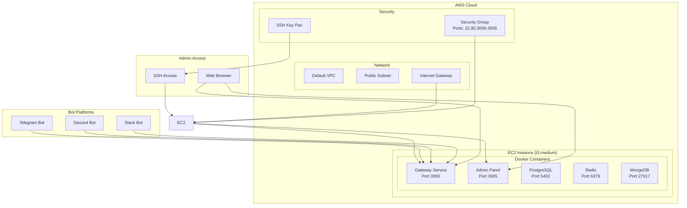

# AWS EC2 部署指南

## 概述

本指南提供了在AWS EC2实例上使用Docker部署Octopus Messenger测试环境的完整方案。这是一个简单、成本效益高的部署方式，适合测试和开发环境。

## 部署架构



## 前置要求

### 1. 安装AWS CLI

```bash
# macOS
brew install awscli

# Linux
curl "https://awscli.amazonaws.com/awscli-exe-linux-x86_64.zip" -o "awscliv2.zip"
unzip awscliv2.zip
sudo ./aws/install
```

### 2. 配置AWS凭证

```bash
aws configure
# 输入以下信息：
# AWS Access Key ID: 你的访问密钥
# AWS Secret Access Key: 你的秘密密钥
# Default region name: us-east-1
# Default output format: json
```

### 3. 确认权限

确保你的AWS账户具有以下权限：
- EC2 实例管理
- 安全组管理
- 密钥对管理
- VPC 访问

## 快速部署

### 1. 下载部署脚本

```bash
# 克隆项目或下载脚本
git clone https://github.com/your-org/octopus-messenger.git
cd octopus-messenger

# 或者直接下载脚本
curl -O https://raw.githubusercontent.com/your-org/octopus-messenger/main/scripts/aws-ec2-deploy.sh
```

### 2. 设置环境变量

```bash
# 必需：设置Telegram Bot Token
export TELEGRAM_BOT_TOKEN="8098345020:AAGdTTRkrjBo46BteA3qOwxgDOXUNhkUl5A"

# 可选：自定义配置
export AWS_REGION="us-east-1"
export PROJECT_NAME="octopus-messenger-test"
export INSTANCE_TYPE="t3.medium"
export KEY_NAME="octopus-messenger-key"
```

### 3. 运行部署脚本

```bash
# 赋予脚本执行权限
chmod +x scripts/aws-ec2-deploy.sh

# 执行部署
./scripts/aws-ec2-deploy.sh
```

### 4. 等待部署完成

部署过程大约需要 10-15 分钟，包括：
- 创建EC2实例
- 安装Docker和Docker Compose
- 创建安全组和密钥对
- 下载和启动应用容器
- 配置服务

## 部署完成后

### 1. 获取访问信息

部署完成后，你会看到类似以下信息：

```
🎉 部署完成!
📋 部署信息:
  - 项目名称: octopus-messenger-test
  - AWS区域: us-east-1
  - 实例ID: i-1234567890abcdef0
  - 实例类型: t3.medium
  - 公网IP: 54.123.45.67
  - 公网DNS: ec2-54-123-45-67.compute-1.amazonaws.com
  - SSH密钥: ~/.ssh/octopus-messenger-key.pem

🔗 访问地址:
  - Gateway API: http://54.123.45.67:3000
  - 健康检查: http://54.123.45.67:3000/health
  - 管理面板: http://54.123.45.67:3005
  - API状态: http://54.123.45.67:3000/api/status

🔧 SSH连接:
  ssh -i ~/.ssh/octopus-messenger-key.pem ec2-user@54.123.45.67
```

### 2. 验证服务状态

```bash
# 检查健康状态
curl http://54.123.45.67:3000/health

# 检查API状态
curl http://54.123.45.67:3000/api/status

# 访问管理面板
open http://54.123.45.67:3005
```

### 3. 配置Telegram Webhook

```bash
# 使用你的实际IP地址和Bot Token
PUBLIC_IP="54.123.45.67"
BOT_TOKEN="8098345020:AAGdTTRkrjBo46BteA3qOwxgDOXUNhkUl5A"

# 设置webhook
curl -X POST "https://api.telegram.org/bot${BOT_TOKEN}/setWebhook" \
     -H "Content-Type: application/json" \
     -d "{\"url\": \"http://${PUBLIC_IP}:3000/webhooks/telegram\"}"

# 验证webhook设置
curl "https://api.telegram.org/bot${BOT_TOKEN}/getWebhookInfo"
```

## 服务管理

### 1. SSH连接到实例

```bash
# 使用部署时生成的密钥
ssh -i ~/.ssh/octopus-messenger-key.pem ec2-user@54.123.45.67

# 进入项目目录
cd octopus-messenger
```

### 2. Docker服务管理

```bash
# 查看服务状态
docker-compose ps

# 查看日志
docker-compose logs -f

# 重启服务
docker-compose restart

# 停止服务
docker-compose down

# 启动服务
docker-compose up -d

# 查看特定服务日志
docker-compose logs -f gateway
docker-compose logs -f admin-panel
```

### 3. 系统监控

```bash
# 查看系统资源使用
htop

# 查看磁盘使用
df -h

# 查看内存使用
free -h

# 查看Docker容器资源使用
docker stats
```

## 配置说明

### 1. 环境变量

主要的环境变量配置在docker-compose.yml中：

```yaml
environment:
  - NODE_ENV=production
  - PORT=3000
  - DB_HOST=postgres
  - DB_PORT=5432
  - DB_NAME=octopus_messenger
  - DB_USER=postgres
  - DB_PASSWORD=Abc123123!
  - REDIS_HOST=redis
  - REDIS_PORT=6379
  - REDIS_PASSWORD=redis123
  - TELEGRAM_BOT_TOKEN=your_bot_token
```

### 2. 端口配置

| 服务 | 内部端口 | 外部端口 | 说明 |
|------|----------|----------|------|
| Gateway | 3000 | 3000 | 主API服务 |
| Admin Panel | 3005 | 3005 | 管理面板 |
| PostgreSQL | 5432 | 5432 | 数据库 |
| Redis | 6379 | 6379 | 缓存 |
| MongoDB | 27017 | 27017 | 文档数据库 |

### 3. 数据持久化

数据通过Docker卷持久化：

```yaml
volumes:
  postgres_data:    # PostgreSQL数据
  redis_data:       # Redis数据
  mongodb_data:     # MongoDB数据
```

## 成本估算

基于AWS定价（us-east-1区域）：

| 资源 | 配置 | 小时费用 | 月费用估算 |
|------|------|----------|-----------|
| EC2 t3.medium | 2 vCPU, 4GB RAM | $0.0416 | ~$30 |
| EBS存储 | 8GB gp3 | $0.0008 | ~$0.64 |
| 数据传输 | 1GB/月 | 变动 | ~$0.09 |
| **总计** | | | **~$31/月** |

> **注意**: 
> - 这是24小时运行的估算费用
> - 实际费用可能因使用量而异
> - 停止实例可以节省计算费用，但存储费用仍会产生

## 安全配置

### 1. 安全组规则

```bash
# 查看安全组配置
aws ec2 describe-security-groups --group-names octopus-messenger-test-sg

# 安全组开放的端口：
# - 22: SSH访问
# - 80: HTTP访问
# - 3000-3005: 应用服务端口
# - 5432: PostgreSQL（仅用于调试）
# - 6379: Redis（仅用于调试）
```

### 2. 安全建议

```bash
# 1. 限制SSH访问IP
aws ec2 authorize-security-group-ingress \
    --group-id sg-xxxxxxxxx \
    --protocol tcp \
    --port 22 \
    --cidr YOUR_IP/32

# 2. 关闭不必要的数据库端口
aws ec2 revoke-security-group-ingress \
    --group-id sg-xxxxxxxxx \
    --protocol tcp \
    --port 5432 \
    --cidr 0.0.0.0/0

# 3. 定期更新系统
ssh -i ~/.ssh/octopus-messenger-key.pem ec2-user@54.123.45.67
sudo yum update -y
```

## 故障排除

### 1. 常见问题

#### 服务无法启动
```bash
# 检查Docker状态
sudo systemctl status docker

# 重启Docker
sudo systemctl restart docker

# 检查容器日志
docker-compose logs gateway
```

#### 无法访问服务
```bash
# 检查安全组
aws ec2 describe-security-groups --group-names octopus-messenger-test-sg

# 检查服务端口
sudo netstat -tlnp | grep 3000

# 检查防火墙
sudo iptables -L
```

#### 内存不足
```bash
# 检查内存使用
free -h

# 检查容器资源使用
docker stats

# 重启服务释放内存
docker-compose restart
```

### 2. 日志查看

```bash
# 系统日志
sudo journalctl -u docker

# 应用日志
docker-compose logs -f --tail=100

# 特定服务日志
docker logs octopus-gateway
docker logs octopus-postgres
```

### 3. 性能优化

```bash
# 增加实例大小
aws ec2 modify-instance-attribute \
    --instance-id i-1234567890abcdef0 \
    --instance-type t3.large

# 优化Docker配置
sudo vim /etc/docker/daemon.json
{
  "log-driver": "json-file",
  "log-opts": {
    "max-size": "10m",
    "max-file": "3"
  }
}
```

## 升级和维护

### 1. 应用更新

```bash
# SSH到实例
ssh -i ~/.ssh/octopus-messenger-key.pem ec2-user@54.123.45.67

# 更新代码
cd octopus-messenger
git pull origin main

# 重新构建并启动
docker-compose build
docker-compose up -d
```

### 2. 数据备份

```bash
# 备份PostgreSQL
docker-compose exec postgres pg_dump -U postgres octopus_messenger > backup.sql

# 备份Redis
docker-compose exec redis redis-cli --rdb /data/dump.rdb

# 备份MongoDB
docker-compose exec mongodb mongodump --out /data/backup
```

### 3. 系统维护

```bash
# 清理Docker
docker system prune -a

# 更新系统
sudo yum update -y

# 检查磁盘空间
df -h
```

## 清理资源

测试完成后，使用清理脚本删除所有资源：

```bash
# 赋予脚本执行权限
chmod +x scripts/aws-ec2-cleanup.sh

# 执行清理
./scripts/aws-ec2-cleanup.sh
```

清理脚本会删除：
- EC2实例
- 安全组
- 密钥对
- 弹性IP（如果有）
- 未附加的EBS卷

## 扩展部署

### 1. 生产环境部署

如需部署到生产环境，建议：
- 使用更大的实例类型（如t3.large或以上）
- 配置SSL证书和域名
- 使用RDS和ElastiCache托管服务
- 配置负载均衡器
- 启用监控和告警

### 2. 多实例部署

```bash
# 创建多个实例
for i in {1..3}; do
    PROJECT_NAME="octopus-messenger-test-$i" ./scripts/aws-ec2-deploy.sh
done
```

## 支持

如需技术支持，请联系：
- 📧 Email: support@octopus-messenger.com
- 🐛 GitHub Issues: https://github.com/your-org/octopus-messenger/issues
- 📚 文档: https://docs.octopus-messenger.com

---

**注意**: 这是测试环境部署方案，不建议用于生产环境。生产环境请参考完整的AWS部署指南。 