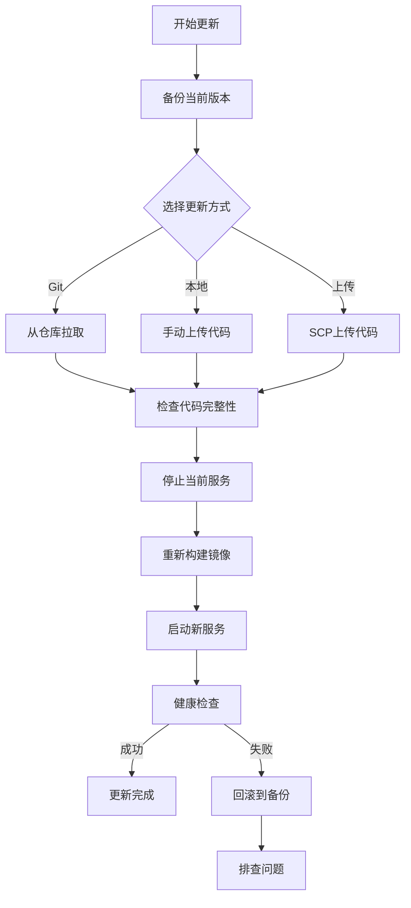

# 代码迭代更新指南

## 概述

本指南详细说明了在Ubuntu测试服务器上如何进行代码迭代更新和重新部署。支持多种更新方式，确保代码更新过程安全、高效。

## 更新流程图



## 支持的更新方式

### 1. Git仓库更新（推荐）

**适用场景**: 代码托管在Git仓库中

```bash
# 设置Git更新方式
export UPDATE_METHOD="git"

# 运行更新脚本
./scripts/ubuntu-update.sh
```

**优点**:
- 自动拉取最新代码
- 保留版本历史
- 支持回滚到任意版本
- 自动处理冲突

### 2. 本地代码更新

**适用场景**: 本地开发后手动同步

```bash
# 1. 先将代码复制到服务器
scp -r ./services/* user@server:~/octopus-messenger/services/

# 2. 在服务器上运行更新
export UPDATE_METHOD="local"
./scripts/ubuntu-update.sh
```

### 3. 上传更新

**适用场景**: 需要交互式上传确认

```bash
# 设置上传更新方式
export UPDATE_METHOD="upload"

# 运行更新脚本（会提示上传命令）
./scripts/ubuntu-update.sh
```

## 详细操作步骤

### 方式一：Git仓库更新（推荐）

#### 1. 准备Git仓库

```bash
# 如果还没有Git仓库，先初始化
cd ~/octopus-messenger
git init
git remote add origin https://github.com/your-org/octopus-messenger.git

# 首次提交
git add .
git commit -m "Initial commit"
git push -u origin main
```

#### 2. 本地开发和提交

```bash
# 在本地开发环境
cd /path/to/your/local/project

# 修改代码...
vim services/gateway/index.js

# 提交更改
git add .
git commit -m "Update gateway service with new features"
git push origin main
```

#### 3. 服务器更新

```bash
# 在服务器上
cd ~/octopus-messenger
chmod +x scripts/ubuntu-update.sh

# 使用Git方式更新
UPDATE_METHOD="git" ./scripts/ubuntu-update.sh
```

### 方式二：本地代码同步

#### 1. 本地开发完成后

```bash
# 在本地环境，同步代码到服务器
# 同步整个services目录
scp -r ./services/* user@your-server:~/octopus-messenger/services/

# 或者只同步特定服务
scp -r ./services/gateway/* user@your-server:~/octopus-messenger/services/gateway/
scp -r ./services/admin-panel/* user@your-server:~/octopus-messenger/services/admin-panel/

# 如果有新的配置文件
scp ./docker-compose.yml user@your-server:~/octopus-messenger/
```

#### 2. 服务器上更新

```bash
# 在服务器上
cd ~/octopus-messenger

# 使用本地方式更新
UPDATE_METHOD="local" ./scripts/ubuntu-update.sh
```

### 方式三：快速手动操作

如果您不想使用脚本，也可以手动执行：

```bash
# 1. 进入项目目录
cd ~/octopus-messenger

# 2. 备份当前版本
cp -r . ../octopus-messenger-backup-$(date +%Y%m%d_%H%M%S)

# 3. 停止服务
docker-compose down

# 4. 更新代码（使用上述任一方式）

# 5. 重新构建和启动
docker-compose build --no-cache
docker-compose up -d

# 6. 检查状态
docker-compose ps
curl http://localhost:3000/health
```

## 常见更新场景

### 1. 修复Bug

```bash
# 场景：修复Gateway服务中的一个bug
# 1. 本地修改代码
vim services/gateway/index.js

# 2. 测试修复
npm test

# 3. 提交代码
git add services/gateway/index.js
git commit -m "Fix: resolve webhook processing bug"
git push origin main

# 4. 服务器更新
UPDATE_METHOD="git" ./scripts/ubuntu-update.sh
```

### 2. 添加新功能

```bash
# 场景：添加新的API端点
# 1. 本地开发新功能
vim services/gateway/index.js
vim services/gateway/package.json  # 如果有新依赖

# 2. 提交代码
git add .
git commit -m "Feature: add new user management API"
git push origin main

# 3. 服务器更新
UPDATE_METHOD="git" ./scripts/ubuntu-update.sh
```

### 3. 更新依赖

```bash
# 场景：更新npm包依赖
# 1. 本地更新依赖
cd services/gateway
npm update
npm audit fix

# 2. 提交更改
git add package.json package-lock.json
git commit -m "Update: upgrade npm dependencies"
git push origin main

# 3. 服务器更新（会重新安装依赖）
UPDATE_METHOD="git" ./scripts/ubuntu-update.sh
```

### 4. 配置变更

```bash
# 场景：修改Docker配置
# 1. 本地修改配置
vim docker-compose.yml

# 2. 提交更改
git add docker-compose.yml
git commit -m "Config: update docker compose settings"
git push origin main

# 3. 服务器更新
UPDATE_METHOD="git" ./scripts/ubuntu-update.sh
```

## 回滚操作

### 自动回滚

如果更新脚本检测到服务异常，可以快速回滚：

```bash
# 更新脚本会提供回滚命令
cd ~/octopus-messenger
docker-compose down
rm -rf ~/octopus-messenger
mv ~/octopus-messenger_backup_20231201_143022 ~/octopus-messenger
cd ~/octopus-messenger
docker-compose up -d
```

### Git版本回滚

```bash
# 回滚到上一个版本
cd ~/octopus-messenger
git reset --hard HEAD~1
docker-compose down
docker-compose build --no-cache
docker-compose up -d

# 回滚到特定版本
git reset --hard <commit-hash>
docker-compose down
docker-compose build --no-cache
docker-compose up -d
```

## 监控和验证

### 1. 健康检查

```bash
# 检查服务健康状态
curl http://localhost:3000/health
curl http://localhost:3005/health

# 检查API功能
curl http://localhost:3000/api/status
curl http://localhost:3000/api/bots
```

### 2. 日志监控

```bash
# 实时查看日志
docker-compose logs -f

# 查看特定服务日志
docker-compose logs -f gateway
docker-compose logs -f admin-panel

# 查看错误日志
docker-compose logs gateway | grep -i error
```

### 3. 性能监控

```bash
# 查看容器资源使用
docker stats

# 查看系统资源
htop
free -h
df -h
```

## 最佳实践

### 1. 更新前准备

```bash
# 检查当前服务状态
docker-compose ps
curl http://localhost:3000/health

# 检查磁盘空间
df -h

# 检查内存使用
free -h
```

### 2. 分阶段更新

```bash
# 1. 先更新非关键服务
# 只更新admin-panel
scp -r ./services/admin-panel/* user@server:~/octopus-messenger/services/admin-panel/
docker-compose restart admin-panel

# 2. 验证无问题后再更新关键服务
scp -r ./services/gateway/* user@server:~/octopus-messenger/services/gateway/
docker-compose restart gateway
```

### 3. 蓝绿部署（高级）

```bash
# 创建新的部署目录
cp -r ~/octopus-messenger ~/octopus-messenger-new
cd ~/octopus-messenger-new

# 更新代码并使用不同端口
sed -i 's/3000:3000/3010:3000/' docker-compose.yml
sed -i 's/3005:3005/3015:3005/' docker-compose.yml

# 启动新版本
docker-compose up -d

# 测试新版本
curl http://localhost:3010/health

# 如果测试通过，切换流量
# 停止旧版本，启动新版本在原端口
```

## 故障排除

### 常见问题

#### 1. 服务启动失败

```bash
# 查看详细日志
docker-compose logs gateway

# 检查端口占用
netstat -tlnp | grep 3000

# 检查磁盘空间
df -h
```

#### 2. 代码更新失败

```bash
# 检查Git状态
git status
git log --oneline -5

# 手动解决冲突
git stash
git pull origin main
git stash pop
```

#### 3. 依赖安装失败

```bash
# 清理npm缓存
docker-compose exec gateway npm cache clean --force

# 重新安装依赖
docker-compose exec gateway npm install
```

### 紧急回滚

```bash
# 立即回滚到备份版本
cd ~/octopus-messenger
docker-compose down
cd ..
rm -rf octopus-messenger
mv octopus-messenger_backup_* octopus-messenger
cd octopus-messenger
docker-compose up -d
```

## 自动化脚本

### 创建快速更新别名

```bash
# 添加到 ~/.bashrc
alias update-octopus="cd ~/octopus-messenger && UPDATE_METHOD=git ./scripts/ubuntu-update.sh"
alias rollback-octopus="cd ~/octopus-messenger && docker-compose down && cd .. && rm -rf octopus-messenger && mv octopus-messenger_backup_* octopus-messenger && cd octopus-messenger && docker-compose up -d"

# 重新加载配置
source ~/.bashrc

# 使用别名
update-octopus
```

### 定时健康检查

```bash
# 创建健康检查脚本
cat > ~/health-check.sh << 'EOF'
#!/bin/bash
if ! curl -s http://localhost:3000/health | grep -q "healthy"; then
    echo "Service unhealthy at $(date)" >> ~/health-check.log
    # 可以添加重启逻辑或告警
fi
EOF

chmod +x ~/health-check.sh

# 添加到crontab（每5分钟检查一次）
echo "*/5 * * * * /home/$(whoami)/health-check.sh" | crontab -
```

## 总结

代码迭代更新的关键要点：

1. **始终备份** - 更新前自动备份当前版本
2. **选择合适的更新方式** - Git仓库更新最为推荐
3. **健康检查** - 更新后验证服务状态
4. **快速回滚** - 遇到问题时能够快速恢复
5. **监控日志** - 实时关注服务运行状态

通过这些方法，您可以安全、高效地在测试服务器上进行代码迭代和更新。 