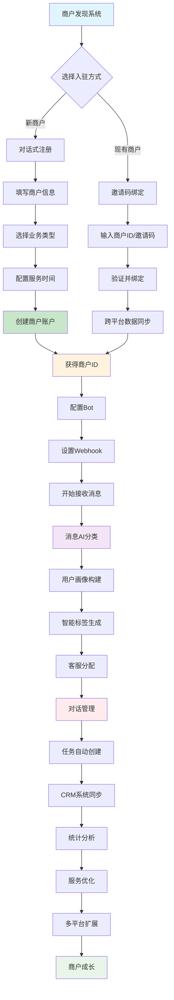
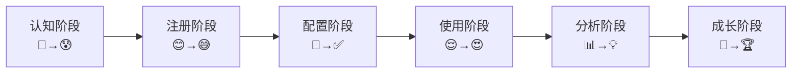

# 🏪 Octopus Messenger 商户客户旅程地图 (CJM)

## 📋 旅程概览

商户在Octopus Messenger系统中的完整客户旅程可以分为**7个关键阶段**，每个阶段都有其独特的触点、情感体验和价值实现。

## 🎯 旅程架构图



## 🚀 第一阶段：认知发现 (Awareness)

### 🎯 触点和场景
- **官网了解**：通过官方网站了解系统功能
- **案例推荐**：看到其他商户的成功案例
- **社群分享**：在商户群或论坛中听到推荐
- **合作伙伴介绍**：通过渠道伙伴了解

### 💭 商户心理状态
- 🤔 **好奇心**：对多平台客服管理感兴趣
- 😰 **担忧**：担心系统复杂度和学习成本
- 🔍 **探索**：想了解具体功能和价格

### 🛠️ 系统支持
- 详细的产品介绍文档
- 成功案例展示
- 免费试用政策
- 在线演示预约

### 📊 关键指标
- 官网访问量
- 案例页面停留时间
- 试用申请转化率
- 咨询量

---

## 🚀 第二阶段：注册入驻 (Registration)

### 🛤️ 两种入驻路径

#### 路径A：新商户注册
```mermaid
graph LR
    A[Bot邀请入群] --> B[选择"创建新商户"]
    B --> C[填写企业信息]
    C --> D[选择业务类型]
    D --> E[配置服务时间]
    E --> F[获得商户ID]
```

#### 路径B：现有商户绑定
```mermaid
graph LR
    A[Bot邀请入群] --> B[选择"绑定现有商户"]
    B --> C[输入商户ID/邀请码]
    C --> D[验证身份]
    D --> E[跨平台数据同步]
```

### 💬 对话式注册体验

```
🏪 请选择您的商户设置方式：

🆕 创建新商户 - 首次使用，创建全新的商户账户
🔗 绑定现有商户 - 已有商户，在新平台添加机器人

💡 如果您已经在其他平台使用过我们的服务，
   请选择"绑定现有商户"来共享数据。
```

### ✅ 商户获得的价值
- **7天免费试用**
- **商户ID: SHOP001**
- **管理后台访问权限**
- **基础客服功能**

### 📊 关键指标
- 注册完成率
- 注册时长
- 信息填写完整度
- 首次登录率

---

## 🛠️ 第三阶段：系统配置 (Configuration)

### 🔧 核心配置任务

#### 1. Bot配置
- 设置Bot名称和头像
- 配置欢迎消息
- 设置自动回复规则

#### 2. 商户信息完善
- 业务类型选择
- 营业时间设置
- 联系方式配置

#### 3. 多平台绑定
- Telegram群组绑定
- WhatsApp Business连接
- Discord服务器集成

### 💻 技术实现示例

```javascript
// 自动生成商户配置
const merchantConfig = {
  merchantId: "SHOP001",
  name: "小王奶茶店",
  businessType: "餐饮服务",
  platforms: ["telegram", "whatsapp", "discord"],
  settings: {
    autoReply: true,
    language: "zh-CN",
    businessHours: {
      start: "09:00",
      end: "21:00"
    },
    welcomeMessage: "欢迎来到小王奶茶店！今天想喝什么呢？"
  }
};
```

### 📊 关键指标
- 配置完成率
- 平台绑定数量
- 首条消息响应时间
- 配置错误率

---

## 💬 第四阶段：消息处理 (Message Processing)

### 🔄 智能消息流转

1. **消息接收**：来自各平台的用户消息
2. **商户识别**：通过MerchantIdentificationService识别归属
3. **AI分类**：自动分类为咨询、投诉、技术支持等
4. **用户画像**：构建完整的用户档案

### 👤 用户画像构建

```json
{
  "userId": "user_123",
  "merchantId": "SHOP001",
  "profile": {
    "displayName": "张三",
    "totalMessages": 15,
    "avgResponseTime": 3.5,
    "satisfactionScore": 0.85,
    "tags": ["VIP客户", "奶茶爱好者", "快速回复"],
    "preferredPlatform": "telegram",
    "estimatedValue": "high",
    "behaviorPattern": {
      "activeHours": ["14:00-16:00", "20:00-22:00"],
      "messageFrequency": "daily",
      "communicationStyle": "casual"
    }
  }
}
```

### 🏷️ 智能标签系统

| 标签类型 | 示例标签 | 生成方式 |
|---------|---------|---------|
| **行为特征** | 重度用户、爱提问、快速回复 | AI行为分析 |
| **生命周期** | 新用户、活跃用户、沉睡用户 | 时间序列分析 |
| **价值特征** | VIP用户、高价值、潜在客户 | 消费行为分析 |
| **沟通特征** | 礼貌用户、表情达人、正式沟通 | NLP情感分析 |

### 📊 关键指标
- 消息处理量
- AI分类准确率
- 用户画像完整度
- 标签覆盖率

---

## 🎯 第五阶段：客服管理 (Customer Service)

### 🤖 智能客服分配

- **技能匹配**：根据问题类型分配专业客服
- **负载均衡**：避免单个客服过载
- **优先级处理**：VIP客户优先响应
- **跨平台统一**：同一客户在不同平台的对话合并

### 🖥️ 客服工作台功能

- 📊 **实时统计**：消息量、响应时间、满意度
- 🏷️ **智能标签**：自动标记客户特征
- 📝 **快速回复**：常用话术模板
- 🔄 **任务转换**：对话转工单功能

### 💡 客服分配策略

```javascript
// 智能客服分配算法
const assignAgent = (message, availableAgents) => {
  const factors = {
    skillMatch: 0.4,      // 技能匹配度
    workload: 0.3,        // 工作负载
    customerHistory: 0.2,  // 客户历史
    responseTime: 0.1     // 响应时间
  };
  
  return calculateBestMatch(message, availableAgents, factors);
};
```

### 📊 关键指标
- 平均响应时间
- 客户满意度
- 问题解决率
- 客服工作效率

---

## 📈 第六阶段：数据分析 (Analytics)

### 📊 商户数据看板

```javascript
// 商户统计数据
const merchantStats = {
  overview: {
    totalBots: 3,
    activeBots: 3,
    totalMessages: 1250,
    totalCustomers: 85,
    activeCustomers7d: 32,
    activePlatforms: ["telegram", "whatsapp", "discord"]
  },
  performance: {
    satisfactionRate: 0.89,
    avgResponseTime: "2.3分钟",
    resolutionRate: 0.94,
    escalationRate: 0.06
  },
  growth: {
    newCustomers7d: 12,
    messageGrowth: "+15%",
    platformExpansion: 2
  }
};
```

### 📈 核心指标监控

#### 业务指标
- **📊 消息量趋势**：日/周/月消息统计
- **👥 客户增长**：新客户获取和留存
- **⭐ 满意度分析**：客户满意度变化趋势
- **🏷️ 标签分布**：客户画像标签统计

#### 运营指标
- **⏱️ 响应时间**：平均首次响应时间
- **🎯 解决率**：问题一次性解决率
- **🔄 转化率**：对话到任务的转化率
- **💰 价值评估**：客户生命周期价值

### 📋 分析报表

#### 日报
- 消息量统计
- 客服工作量
- 问题分类分布
- 客户满意度

#### 周报
- 趋势分析
- 异常检测
- 改进建议
- 竞品对比

#### 月报
- 业务增长分析
- ROI计算
- 战略建议
- 功能使用情况

### 📊 关键指标
- 数据准确性
- 报表使用频率
- 决策响应时间
- 业务改进效果

---

## 🚀 第七阶段：成长扩展 (Growth)

### 📈 商户成长路径

#### 阶段1：单平台成熟
- ✅ 在首个平台建立稳定服务
- ✅ 客服流程标准化
- ✅ 基础数据积累

#### 阶段2：多平台扩展
- 🔄 逐步接入更多聊天平台
- 📊 跨平台数据统一
- 🎯 多渠道客户管理

#### 阶段3：功能升级
- 🧠 开通高级AI功能
- 🔗 CRM系统集成
- 📈 高级分析功能

#### 阶段4：规模化运营
- 🏪 多店铺管理
- 👥 团队协作功能
- 🌐 企业级部署

### 💰 价值实现

#### 效率提升
- 📈 客服响应时间减少60%
- 🤖 自动化处理率提升40%
- ⚡ 问题解决速度提升50%

#### 成本降低
- 💰 人工客服成本节省40%
- 🔧 运维成本降低30%
- 📞 通讯成本优化25%

#### 业务增长
- 🎯 基于用户画像的精准营销
- 🔄 客户满意度提升带来复购增长
- 📊 数据驱动的业务决策

### 🎯 成长里程碑

| 里程碑 | 指标 | 预期时间 |
|--------|------|---------|
| **平台熟练** | 日均处理100+消息 | 1个月 |
| **多平台运营** | 接入3+平台 | 3个月 |
| **数据驱动** | 使用高级分析功能 | 6个月 |
| **规模化** | 管理多个商户 | 12个月 |

### 📊 关键指标
- 平台扩展速度
- 功能使用深度
- 业务增长率
- 客户生命周期价值

---

## 🎭 情感体验曲线

### 各阶段情感变化



#### 详细情感描述
- **认知阶段**：🤔 好奇 → 😰 担忧
- **注册阶段**：😊 兴奋 → 😅 学习
- **配置阶段**：🔧 专注 → ✅ 成就
- **使用阶段**：😌 满意 → 😍 惊喜
- **分析阶段**：📊 理性 → 💡 洞察
- **成长阶段**：🚀 自信 → 🏆 成功

---

## 🎯 关键成功因素

### 1. 🚀 无缝入驻体验
- **对话式注册**：降低技术门槛
- **一键绑定**：现有商户快速接入
- **免费试用**：7天无风险体验
- **即时反馈**：实时配置验证

### 2. 🧠 智能化程度
- **AI分类准确率**：>85%的自动分类准确度
- **智能用户画像**：多维度客户分析
- **个性化推荐**：基于数据的服务优化
- **预测性分析**：提前识别客户需求

### 3. 🌐 跨平台统一
- **数据同步**：同一商户多平台数据统一
- **统一界面**：一站式管理多个平台
- **一致体验**：跨平台的用户体验一致性
- **智能路由**：自动识别最优沟通渠道

### 4. 📊 数据驱动决策
- **实时分析**：即时数据洞察
- **可视化报表**：直观的业务仪表板
- **智能建议**：基于AI的业务优化建议
- **ROI追踪**：投资回报率实时监控

---

## 📋 实施检查清单

### 🎯 阶段一检查点
- [ ] 产品介绍页面完善
- [ ] 成功案例库建立
- [ ] 试用流程优化
- [ ] 客户反馈收集机制

### 🚀 阶段二检查点
- [ ] 对话式注册流程测试
- [ ] 邀请码系统验证
- [ ] 跨平台绑定功能
- [ ] 用户引导完善

### 🛠️ 阶段三检查点
- [ ] Bot配置向导
- [ ] 多平台集成测试
- [ ] 配置验证机制
- [ ] 错误处理优化

### 💬 阶段四检查点
- [ ] AI分类模型训练
- [ ] 用户画像算法
- [ ] 消息路由逻辑
- [ ] 实时处理能力

### 🎯 阶段五检查点
- [ ] 客服分配算法
- [ ] 工作台界面优化
- [ ] 响应时间监控
- [ ] 满意度调研

### 📈 阶段六检查点
- [ ] 数据分析平台
- [ ] 报表系统建设
- [ ] 指标监控告警
- [ ] 决策支持工具

### 🚀 阶段七检查点
- [ ] 成长路径规划
- [ ] 功能升级机制
- [ ] 规模化支持
- [ ] 企业级功能

---

## 🎉 总结

Octopus Messenger的商户客户旅程地图展现了一个完整的数字化客服解决方案生命周期。从初次认知到规模化成长，每个阶段都有明确的价值交付和体验优化点。

### 🏆 核心优势
1. **低门槛入驻**：对话式注册，技术小白也能快速上手
2. **智能化运营**：AI驱动的客服管理，提升效率降低成本
3. **跨平台统一**：一套系统管理多个沟通渠道
4. **数据驱动**：全面的分析洞察，支持业务决策
5. **可持续成长**：从单店到连锁，从基础到高级的完整成长路径

这个客户旅程地图不仅是产品设计的指导原则，更是商户成功的路线图，确保每一位商户都能在数字化转型的道路上获得成功。 