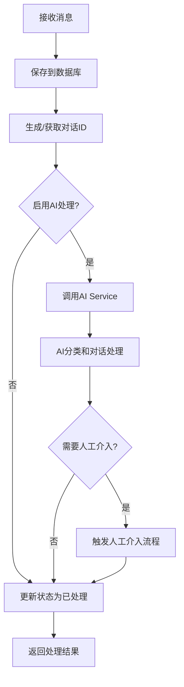
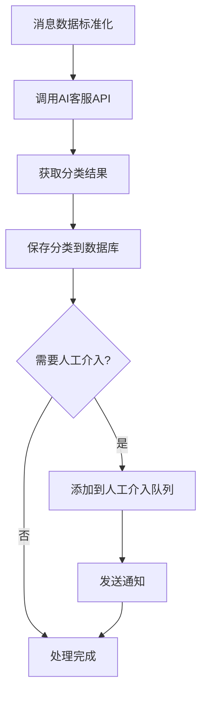

# Message Processor AI Integration Guide

## 概述

Message Processor 已经完全集成了 AI 客服功能，现在可以自动处理消息的 AI 分类、多语言翻译、对话管理和人工介入检测。

## 主要更新

### 1. 新增组件

#### AIServiceClient (`src/utils/AIServiceClient.js`)
- **功能**: 与 AI Service 通信的客户端
- **核心方法**:
  - `processCustomerServiceChat()` - 处理客服对话
  - `classifyMessage()` - 智能分类消息
  - `translateText()` - 文本翻译
  - `triggerHumanHandoff()` - 触发人工介入
  - `generateConversationId()` - 生成对话ID
- **特性**:
  - 自动重试机制
  - 服务间通信认证
  - 错误处理和日志记录

#### MessageProcessor (`src/processors/MessageProcessor.js`)
- **功能**: 增强的消息处理器，集成 AI 功能
- **核心功能**:
  - 消息保存和状态管理
  - AI 分类和对话处理
  - 对话ID生成和管理
  - 人工介入检测和处理
  - 批量消息处理
- **统计功能**:
  - 处理统计（成功/失败/AI处理/翻译/人工介入）
  - 性能指标计算

#### MessageQueue (`src/queues/MessageQueue.js`)
- **功能**: 基于 Bull 的消息队列管理
- **队列类型**:
  - `message-processing` - 消息处理队列
  - `ai-classification` - AI分类队列
  - `human-handoff` - 人工介入队列
  - `translation` - 翻译队列
  - `notification` - 通知队列
- **特性**:
  - 并发控制
  - 重试机制
  - 任务优先级
  - 队列监控和清理

### 2. API 路由

#### Messages API (`src/routes/messages.js`)
```
POST /api/messages/process              - 处理单个消息
POST /api/messages/process/batch        - 批量处理消息
GET  /api/messages/:messageId/status    - 获取消息状态
GET  /api/messages/unprocessed          - 获取未处理消息
POST /api/messages/:messageId/reprocess - 重新处理失败消息
GET  /api/messages/stats                - 获取消息统计
GET  /api/messages/processor/status     - 获取处理器状态
POST /api/messages/process/backlog      - 处理积压消息
```

#### Process Management API (`src/routes/process.js`)
```
GET  /api/process/queues                - 获取队列状态
GET  /api/process/queues/:queueName     - 获取特定队列信息
POST /api/process/queues/:queueName/pause   - 暂停队列
POST /api/process/queues/:queueName/resume  - 恢复队列
POST /api/process/queues/clean          - 清理队列
POST /api/process/ai-classify           - 添加AI分类任务
POST /api/process/translate             - 添加翻译任务
POST /api/process/handoff               - 触发人工介入
POST /api/process/notify                - 发送通知
POST /api/process/batch-process         - 批量处理任务
GET  /api/process/metrics               - 获取性能指标
POST /api/process/reset-stats           - 重置统计
GET  /api/process/health                - 健康检查
```

## 集成流程

### 消息处理流程



### AI 处理流程



## 配置

### 环境变量

```bash
# AI Service 配置
AI_SERVICE_URL=http://ai-service:3001
SERVICE_TOKEN=your-service-token

# 队列配置
REDIS_HOST=localhost
REDIS_PORT=6379
REDIS_PASSWORD=your-redis-password

# 处理器配置
ENABLE_AI_PROCESSING=true
ENABLE_TRANSLATION=false
BATCH_SIZE=10
PROCESSING_TIMEOUT=30000
```

### 配置文件更新

需要在 `config/config.js` 中添加：

```javascript
// Message Processor 配置
messageProcessor: {
  port: process.env.MESSAGE_PROCESSOR_PORT || 3002,
  host: process.env.MESSAGE_PROCESSOR_HOST || '0.0.0.0',
  enableAI: process.env.ENABLE_AI_PROCESSING !== 'false',
  enableTranslation: process.env.ENABLE_TRANSLATION === 'true',
  batchSize: parseInt(process.env.BATCH_SIZE) || 10,
  processingTimeout: parseInt(process.env.PROCESSING_TIMEOUT) || 30000
},

// AI Service 客户端配置
aiService: {
  baseURL: process.env.AI_SERVICE_URL || 'http://localhost:3001',
  timeout: 30000,
  retries: 3
},

// 队列配置
queue: {
  redis: {
    host: process.env.REDIS_HOST || 'localhost',
    port: process.env.REDIS_PORT || 6379,
    password: process.env.REDIS_PASSWORD
  },
  concurrency: parseInt(process.env.QUEUE_CONCURRENCY) || 5,
  attempts: parseInt(process.env.QUEUE_ATTEMPTS) || 3
}
```

## 使用示例

### 1. 处理单个消息

```javascript
// POST /api/messages/process
{
  "tenantId": "tenant123",
  "platform": "telegram",
  "senderId": "user456",
  "content": "我的信用卡被盗刷了，怎么办？",
  "channelId": "channel789",
  "language": "zh-CN",
  "enableAI": true,
  "enableTranslation": false
}
```

响应：
```javascript
{
  "success": true,
  "data": {
    "messageId": "msg_123",
    "conversationId": "conv_abc123_1234567890",
    "processingTime": 1500,
    "aiResult": {
      "classification": {
        "category": "billing",
        "confidence": 0.95,
        "urgency": "high",
        "escalate": true
      },
      "needsHandoff": true,
      "handoffReason": "High urgency billing issue requires immediate attention",
      "language": "zh-CN"
    }
  }
}
```

### 2. 批量处理消息

```javascript
// POST /api/messages/process/batch
{
  "messages": [
    {
      "tenantId": "tenant123",
      "platform": "telegram",
      "senderId": "user1",
      "content": "账单问题"
    },
    {
      "tenantId": "tenant123", 
      "platform": "telegram",
      "senderId": "user2",
      "content": "Technical support needed"
    }
  ],
  "enableAI": true
}
```

### 3. 获取处理统计

```javascript
// GET /api/messages/stats?tenantId=tenant123
{
  "success": true,
  "data": {
    "overview": {
      "totalMessages": 1000,
      "processed": 950,
      "failed": 10,
      "pending": 40,
      "avgProcessingTime": 1200
    },
    "classifications": [
      {
        "category": "billing",
        "count": 300,
        "avgConfidence": 0.89,
        "handoffCount": 45
      }
    ]
  }
}
```

### 4. 队列管理

```javascript
// 获取队列状态
// GET /api/process/queues
{
  "success": true,
  "data": {
    "message-processing": {
      "waiting": 5,
      "active": 3,
      "completed": 1000,
      "failed": 10
    },
    "ai-classification": {
      "waiting": 2,
      "active": 1,
      "completed": 500,
      "failed": 5
    }
  }
}

// 暂停队列
// POST /api/process/queues/message-processing/pause

// 恢复队列  
// POST /api/process/queues/message-processing/resume
```

### 5. 人工介入

```javascript
// POST /api/process/handoff
{
  "conversationId": "conv_abc123_1234567890",
  "reason": "Customer requesting human agent",
  "type": "manual",
  "priority": "high",
  "assignedAgent": "agent001"
}
```

## 监控和运维

### 健康检查

```bash
curl http://localhost:3002/health
curl http://localhost:3002/api/process/health
```

### 性能指标

```bash
curl http://localhost:3002/api/process/metrics
```

返回详细的性能指标：
- 处理速率（每秒/每分钟消息数）
- AI处理率
- 人工介入率
- 队列状态
- 系统资源使用情况

### 日志监控

系统会记录详细的处理日志：

```javascript
// 消息处理开始
logger.logProcessing(messageId, 'start', {
  tenantId,
  platform,
  contentLength
});

// AI处理完成
logger.info('AI processing completed', {
  messageId,
  category: classification.category,
  needsHandoff: result.needsHandoff
});

// 人工介入触发
logger.info('Human handoff triggered', {
  conversationId,
  reason,
  urgency
});
```

## 错误处理

### 常见错误和解决方案

1. **AI Service 连接失败**
   - 检查 AI_SERVICE_URL 配置
   - 验证服务间通信 token
   - 查看 AI Service 健康状态

2. **Redis 连接失败**
   - 检查 Redis 服务状态
   - 验证 Redis 连接配置
   - 检查网络连通性

3. **数据库连接问题**
   - 检查 PostgreSQL 服务状态
   - 验证数据库连接字符串
   - 确认数据库 schema 已更新

4. **队列处理失败**
   - 查看队列错误日志
   - 检查并发配置
   - 验证任务数据格式

## 部署注意事项

### Docker 配置

确保 Docker Compose 中包含必要的服务依赖：

```yaml
message-processor:
  depends_on:
    - postgres
    - redis
    - ai-service
  environment:
    - AI_SERVICE_URL=http://ai-service:3001
    - REDIS_HOST=redis
    - DATABASE_HOST=postgres
```

### 数据库迁移

部署前确保运行了最新的数据库迁移：

```bash
cd database/migrations
psql -h localhost -U postgres -d octopus -f 008_add_ai_customer_service.sql
```

### 扩展性考虑

- **水平扩展**: 可以部署多个 message-processor 实例
- **队列分片**: 根据 tenantId 或消息类型分片处理
- **缓存优化**: 利用 Redis 缓存对话上下文和翻译结果
- **监控告警**: 设置队列积压和处理失败的告警

## 与其他服务的集成

### Gateway 集成

Gateway 可以通过以下方式调用 message-processor：

```javascript
// 处理接收到的消息
const response = await axios.post('http://message-processor:3002/api/messages/process', {
  tenantId: message.tenantId,
  platform: message.platform,
  senderId: message.senderId,
  content: message.content,
  enableAI: true
});
```

### Bot Manager 集成

Bot Manager 接收到消息后发送到 message-processor：

```javascript
// 在 TelegramBot.js 中
async handleMessage(message) {
  // ... 消息预处理
  
  // 发送到 message-processor
  await this.sendToProcessor({
    tenantId: this.tenantId,
    platform: 'telegram',
    senderId: message.from.id,
    content: message.text,
    channelId: message.chat.id
  });
}
```

## 总结

Message Processor 现在完全支持 AI 客服功能：

1. **自动化处理**: 消息自动通过 AI 分类和对话管理
2. **智能路由**: 基于分类结果和置信度自动路由
3. **人工介入**: 智能检测需要人工介入的情况
4. **多语言支持**: 自动检测语言并支持翻译
5. **队列管理**: 高效的异步处理和任务管理
6. **监控运维**: 完整的监控、日志和健康检查机制

系统现在可以处理大规模的客服消息，自动分类、智能路由，并在需要时无缝转接人工客服。 