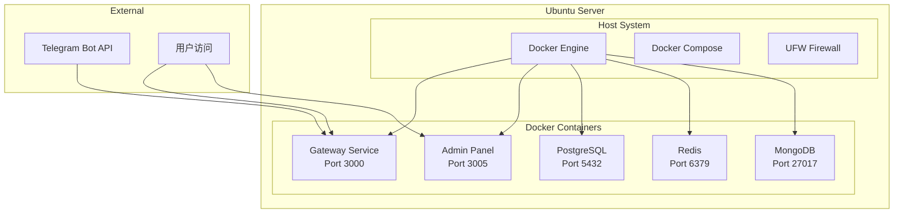

# Ubuntu 服务器部署指南

## 概述

本指南适用于已有Ubuntu服务器的用户，提供了在Ubuntu服务器上直接部署Octopus Messenger的完整方案。无需创建新的AWS资源，直接在现有服务器上使用Docker部署。

## 系统要求

### 最低配置
- **操作系统**: Ubuntu 18.04+ (推荐 20.04 LTS 或 22.04 LTS)
- **CPU**: 2核心以上
- **内存**: 4GB以上
- **存储**: 10GB以上可用空间
- **网络**: 公网IP（用于Telegram Webhook）

### 推荐配置
- **CPU**: 4核心
- **内存**: 8GB
- **存储**: 20GB SSD
- **网络**: 稳定的公网连接

## 部署架构



## 快速部署

### 1. 准备工作

```bash
# 更新系统
sudo apt update && sudo apt upgrade -y

# 检查系统信息
lsb_release -a
free -h
df -h
```

### 2. 下载部署脚本

```bash
# 如果有git仓库
git clone https://github.com/your-org/octopus-messenger.git
cd octopus-messenger

# 或者直接下载脚本
wget https://raw.githubusercontent.com/your-org/octopus-messenger/main/scripts/ubuntu-deploy.sh
chmod +x ubuntu-deploy.sh
```

### 3. 设置环境变量

```bash
# 设置Telegram Bot Token
export TELEGRAM_BOT_TOKEN="8098345020:AAGdTTRkrjBo46BteA3qOwxgDOXUNhkUl5A"

# 可选：自定义项目名称
export PROJECT_NAME="octopus-messenger"
```

### 4. 执行部署

```bash
# 运行部署脚本
./scripts/ubuntu-deploy.sh
```

## 部署过程

部署脚本会自动完成以下步骤：

### 1. 系统检查和更新
- 检查Ubuntu版本和系统资源
- 更新系统包
- 安装必要的基础工具

### 2. 安装Docker环境
- 安装Docker CE
- 安装Docker Compose
- 配置Docker用户权限
- 启动Docker服务

### 3. 创建应用结构
- 创建项目目录
- 生成Docker Compose配置
- 创建服务代码文件
- 初始化数据库脚本

### 4. 启动服务
- 拉取Docker镜像
- 启动所有容器
- 检查服务健康状态
- 输出访问信息

## 部署完成后

### 1. 验证服务状态

```bash
# 检查容器状态
cd ~/octopus-messenger
docker-compose ps

# 检查服务健康状态
curl http://localhost:3000/health
curl http://localhost:3005/health
```

### 2. 配置防火墙

```bash
# 安装和配置UFW
sudo ufw enable
sudo ufw allow 22/tcp    # SSH
sudo ufw allow 3000/tcp  # Gateway
sudo ufw allow 3005/tcp  # Admin Panel
sudo ufw status
```

### 3. 配置Telegram Webhook

```bash
# 获取服务器公网IP
PUBLIC_IP=$(curl -s http://checkip.amazonaws.com/)

# 设置Webhook
curl -X POST "https://api.telegram.org/bot${TELEGRAM_BOT_TOKEN}/setWebhook" \
     -H "Content-Type: application/json" \
     -d "{\"url\": \"http://${PUBLIC_IP}:3000/webhooks/telegram\"}"

# 验证Webhook设置
curl "https://api.telegram.org/bot${TELEGRAM_BOT_TOKEN}/getWebhookInfo"
```

## 服务管理

### 1. 基本操作

```bash
# 进入项目目录
cd ~/octopus-messenger

# 查看服务状态
docker-compose ps

# 查看日志
docker-compose logs -f

# 重启服务
docker-compose restart

# 停止服务
docker-compose down

# 启动服务
docker-compose up -d
```

### 2. 单个服务管理

```bash
# 重启特定服务
docker-compose restart gateway
docker-compose restart admin-panel

# 查看特定服务日志
docker-compose logs -f gateway
docker-compose logs -f postgres

# 进入容器
docker-compose exec gateway sh
docker-compose exec postgres psql -U postgres -d octopus_messenger
```

### 3. 系统监控

```bash
# 查看资源使用
docker stats

# 查看系统资源
htop
free -h
df -h

# 查看网络端口
netstat -tlnp | grep -E '3000|3005|5432|6379'
```

## 配置说明

### 1. 端口配置

| 服务 | 端口 | 说明 | 外部访问 |
|------|------|------|----------|
| Gateway | 3000 | 主API服务 | ✅ |
| Admin Panel | 3005 | 管理面板 | ✅ |
| PostgreSQL | 5432 | 数据库 | ❌ |
| Redis | 6379 | 缓存 | ❌ |
| MongoDB | 27017 | 文档数据库 | ❌ |

### 2. 环境变量

主要配置在`docker-compose.yml`中：

```yaml
environment:
  - NODE_ENV=production
  - TELEGRAM_BOT_TOKEN=your_bot_token
  - DB_HOST=postgres
  - DB_PASSWORD=Abc123123!
  - REDIS_PASSWORD=redis123
  - JWT_SECRET=test-jwt-secret
```

### 3. 数据持久化

数据通过Docker卷持久化：

```yaml
volumes:
  postgres_data:    # 数据库数据
  redis_data:       # Redis数据
  mongodb_data:     # MongoDB数据
```

## 安全配置

### 1. 防火墙设置

```bash
# 基础防火墙配置
sudo ufw default deny incoming
sudo ufw default allow outgoing
sudo ufw allow 22/tcp
sudo ufw allow 3000/tcp
sudo ufw allow 3005/tcp

# 如果需要限制特定IP访问
sudo ufw allow from YOUR_IP to any port 22
sudo ufw allow from YOUR_IP to any port 3005
```

### 2. SSL配置（可选）

```bash
# 安装Nginx
sudo apt install nginx

# 安装Certbot
sudo apt install certbot python3-certbot-nginx

# 配置SSL证书
sudo certbot --nginx -d your-domain.com
```

### 3. 数据库安全

```bash
# 修改默认密码
# 编辑docker-compose.yml中的密码配置
# 然后重新创建容器
docker-compose down
docker-compose up -d
```

## 故障排除

### 1. 常见问题

#### Docker权限问题
```bash
# 如果遇到权限问题
sudo usermod -aG docker $USER
newgrp docker
# 或者重新登录
```

#### 端口被占用
```bash
# 检查端口使用情况
sudo netstat -tlnp | grep 3000
sudo lsof -i :3000

# 杀死占用进程
sudo kill -9 PID
```

#### 内存不足
```bash
# 检查内存使用
free -h
docker stats

# 清理Docker
docker system prune -a
```

### 2. 服务调试

```bash
# 查看容器详细信息
docker-compose logs gateway --tail=100

# 检查容器内部
docker-compose exec gateway sh
ps aux
netstat -tlnp
```

### 3. 网络问题

```bash
# 检查网络连接
curl -I http://localhost:3000/health
telnet localhost 3000

# 检查防火墙
sudo ufw status
sudo iptables -L
```

## 性能优化

### 1. 系统优化

```bash
# 增加文件描述符限制
echo "* soft nofile 65536" | sudo tee -a /etc/security/limits.conf
echo "* hard nofile 65536" | sudo tee -a /etc/security/limits.conf

# 优化内核参数
echo "net.core.somaxconn = 65536" | sudo tee -a /etc/sysctl.conf
sudo sysctl -p
```

### 2. Docker优化

```bash
# 配置Docker日志
sudo tee /etc/docker/daemon.json << EOF
{
  "log-driver": "json-file",
  "log-opts": {
    "max-size": "10m",
    "max-file": "3"
  }
}
EOF

sudo systemctl restart docker
```

### 3. 应用优化

```bash
# 调整容器资源限制
# 编辑docker-compose.yml添加：
deploy:
  resources:
    limits:
      memory: 512M
    reservations:
      memory: 256M
```

## 备份和恢复

### 1. 数据备份

```bash
# 备份PostgreSQL
docker-compose exec postgres pg_dump -U postgres octopus_messenger > backup_$(date +%Y%m%d).sql

# 备份Redis
docker-compose exec redis redis-cli --rdb /data/dump.rdb

# 备份整个项目
tar -czf octopus_backup_$(date +%Y%m%d).tar.gz ~/octopus-messenger
```

### 2. 数据恢复

```bash
# 恢复PostgreSQL
docker-compose exec -T postgres psql -U postgres octopus_messenger < backup_20231201.sql

# 恢复项目
tar -xzf octopus_backup_20231201.tar.gz -C ~/
```

## 升级和维护

### 1. 应用更新

```bash
# 更新代码
cd ~/octopus-messenger
git pull origin main

# 重新构建和启动
docker-compose build
docker-compose up -d
```

### 2. 系统维护

```bash
# 清理Docker
docker system prune -a -f

# 更新系统
sudo apt update && sudo apt upgrade -y

# 重启系统（如果需要）
sudo reboot
```

### 3. 监控设置

```bash
# 安装监控工具
sudo apt install htop iotop nethogs

# 设置日志轮转
sudo tee /etc/logrotate.d/docker-compose << EOF
/home/*/octopus-messenger/*.log {
    daily
    rotate 7
    compress
    delaycompress
    missingok
    notifempty
}
EOF
```

## 卸载

### 1. 停止服务

```bash
cd ~/octopus-messenger
docker-compose down -v
```

### 2. 清理Docker

```bash
# 删除镜像
docker rmi $(docker images -q)

# 清理系统
docker system prune -a -f
```

### 3. 删除文件

```bash
# 删除项目文件
rm -rf ~/octopus-messenger

# 卸载Docker（可选）
sudo apt remove docker-ce docker-ce-cli containerd.io
sudo rm -rf /var/lib/docker
```

## 支持

如需技术支持，请联系：
- 📧 Email: support@octopus-messenger.com
- 🐛 GitHub Issues: https://github.com/your-org/octopus-messenger/issues
- 📚 文档: https://docs.octopus-messenger.com

---

**注意**: 此部署方案适用于测试和开发环境。生产环境建议使用更完善的安全配置和监控方案。 